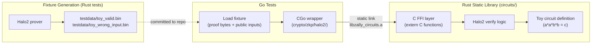

# Halo2 FFI Verification Infrastructure

## Context

Currently, `[crypto/zkp/verify.go](crypto/zkp/verify.go)` and `[crypto/redpallas/verify.go](crypto/redpallas/verify.go)` are mock implementations that always return `nil`. We need real proof verification callable from Go tests. The approach: build a Rust static library exposing C-compatible verify functions, link it via CGo, and validate with a toy Halo2 circuit before implementing the real ZKP #1/#2/#3 circuits.

## Architecture




## Phase 1: Rust Crate (`circuits/`)

Create a new Rust crate at the repo root that builds as a static library.

`**circuits/Cargo.toml**` -- key dependencies:

- `halo2_proofs` (from `zcash/halo2`) -- the proof system, native Pallas/Vesta support
- `pasta_curves` -- Pallas field arithmetic (`Fp`)

`**circuits/src/toy.rs**` -- Toy circuit adapted from the [official halo2 simple-example](https://github.com/zcash/halo2/blob/main/halo2_proofs/examples/simple-example.rs). Circuit proves knowledge of private `(a, b)` such that `constant * a^2 * b^2 = c` where `c` is a public input. This exercises the full prove/verify pipeline on the Pallas curve without needing Poseidon gadgets yet.

`**circuits/src/ffi.rs**` -- C-compatible FFI functions:

```rust
/// Verify a toy circuit proof.
/// Returns 0 on success, non-zero error code on failure.
#[no_mangle]
pub extern "C" fn zally_verify_toy_proof(
    proof_ptr: *const u8, proof_len: usize,
    public_inputs_ptr: *const u8, public_inputs_len: usize,
) -> i32 { ... }
```

The verification key and params (IPA SRS) are lazily initialized as statics (they are deterministic for a given circuit + `k`).

`**circuits/src/lib.rs**` -- ties modules together, sets `crate-type = ["staticlib", "lib"]`.

`**circuits/src/fixtures.rs**` -- a test helper (used only in `cargo test`) that generates valid and invalid proof byte vectors and writes them to `circuits/testdata/`.

## Phase 2: Fixture Generation

A Rust integration test (`circuits/tests/generate_fixtures.rs`) that:

1. Constructs the toy circuit with known inputs (`constant=7, a=2, b=3`, so `c = 7*4*9 = 252`)
2. Generates params and proving key
3. Creates a real Halo2 proof
4. Serializes proof bytes to `crypto/zkp/testdata/toy_valid_proof.bin`
5. Serializes the public input (`c` as Pallas `Fp` in 32-byte LE) to `crypto/zkp/testdata/toy_valid_input.bin`
6. Also generates `toy_wrong_input.bin` (a different `c` value) for negative tests

These fixture files are committed to the repo so Go tests don't need the Rust prover at test time.

## Phase 3: C Header + Go CGo Bindings

`**circuits/include/zally_circuits.h**` -- hand-written C header (small enough that cbindgen is overkill):

```c
#include <stdint.h>
#include <stddef.h>

int32_t zally_verify_toy_proof(
    const uint8_t* proof_ptr, size_t proof_len,
    const uint8_t* public_inputs_ptr, size_t public_inputs_len
);
```

`**crypto/zkp/halo2/verify.go**` -- CGo wrapper, gated by build tag `halo2`:

```go
//go:build halo2

package halo2

/*
#cgo LDFLAGS: -L${SRCDIR}/../../../circuits/target/release -lzally_circuits -ldl -lm -lpthread
#include "../../../circuits/include/zally_circuits.h"
*/
import "C"

func VerifyToyProof(proof, publicInputs []byte) error {
    rc := C.zally_verify_toy_proof(
        (*C.uint8_t)(&proof[0]), C.size_t(len(proof)),
        (*C.uint8_t)(&publicInputs[0]), C.size_t(len(publicInputs)),
    )
    if rc != 0 { return fmt.Errorf("halo2 verify failed: code %d", rc) }
    return nil
}
```

`**crypto/zkp/halo2/verify_test.go**` -- the key deliverable:

```go
//go:build halo2

func TestToyProofValid(t *testing.T) {
    proof := mustReadFixture(t, "testdata/toy_valid_proof.bin")
    input := mustReadFixture(t, "testdata/toy_valid_input.bin")
    require.NoError(t, VerifyToyProof(proof, input))
}

func TestToyProofWrongInput(t *testing.T) {
    proof := mustReadFixture(t, "testdata/toy_valid_proof.bin")
    wrongInput := mustReadFixture(t, "testdata/toy_wrong_input.bin")
    require.Error(t, VerifyToyProof(proof, wrongInput))
}

func TestToyProofCorrupted(t *testing.T) {
    proof := mustReadFixture(t, "testdata/toy_valid_proof.bin")
    proof[0] ^= 0xFF // flip a byte
    input := mustReadFixture(t, "testdata/toy_valid_input.bin")
    require.Error(t, VerifyToyProof(proof, input))
}
```

## Phase 4: Build Integration

### Makefile additions

```makefile
## circuits: Build the Rust static library
circuits:
	cargo build --release --manifest-path circuits/Cargo.toml

## fixtures: Generate proof fixtures (requires circuits build)
fixtures: circuits
	cargo test --release --manifest-path circuits/Cargo.toml -- generate_fixtures --ignored

## test-halo2: Run Go tests that use real Halo2 verification (requires circuits)
test-halo2: circuits
	go test -tags halo2 -count=1 -race ./crypto/zkp/halo2/...
```

### Build tag strategy

- `go test ./...` (default) -- runs all existing tests with mock verifiers; no Rust needed
- `go test -tags halo2 ./crypto/zkp/halo2/...` -- runs real Halo2 verification tests; requires `circuits/target/release/libzally_circuits.a` to exist
- This keeps the default developer experience unchanged while enabling real proof verification when Rust is available

### CI update (`[.github/workflows/ci.yml](.github/workflows/ci.yml)`)

Add a new job `test-halo2` that:

1. Checks out code
2. Sets up Go 1.23
3. Installs Rust toolchain (`actions/setup-rust@v1` or `dtolnay/rust-toolchain@stable`)
4. Runs `make circuits`
5. Runs `make test-halo2`

Existing `test-unit` and `test-integration` jobs remain unchanged (no Rust dependency).

### .gitignore additions

```
circuits/target/
```

## File Summary


| File                                      | Action   | Purpose                                          |
| ----------------------------------------- | -------- | ------------------------------------------------ |
| `circuits/Cargo.toml`                     | Create   | Rust crate config                                |
| `circuits/src/lib.rs`                     | Create   | Crate entry point                                |
| `circuits/src/toy.rs`                     | Create   | Toy Halo2 circuit                                |
| `circuits/src/ffi.rs`                     | Create   | C FFI exports                                    |
| `circuits/src/fixtures.rs`                | Create   | Fixture generation helpers                       |
| `circuits/tests/generate_fixtures.rs`     | Create   | Generates proof fixture files                    |
| `circuits/include/zally_circuits.h`       | Create   | C header for FFI                                 |
| `crypto/zkp/halo2/verify.go`              | Create   | CGo wrapper (build tag: halo2)                   |
| `crypto/zkp/halo2/verify_test.go`         | Create   | Go tests with real proofs                        |
| `crypto/zkp/testdata/toy_valid_proof.bin` | Generate | Valid proof fixture                              |
| `crypto/zkp/testdata/toy_valid_input.bin` | Generate | Valid public input fixture                       |
| `crypto/zkp/testdata/toy_wrong_input.bin` | Generate | Wrong public input for negative test             |
| `Makefile`                                | Edit     | Add `circuits`, `fixtures`, `test-halo2` targets |
| `.github/workflows/ci.yml`                | Edit     | Add `test-halo2` CI job with Rust toolchain      |
| `.gitignore`                              | Edit     | Add `circuits/target/`                           |


## Future Extension Path

Once this toy pipeline is proven, the next step is to add real circuit verify functions to the Rust crate (e.g., `zally_verify_delegation_proof`) and wire them into the existing `zkp.Verifier` interface via a `Halo2Verifier` struct in `crypto/zkp/`. The app would then be configurable: `DefaultOpts()` returns mock verifiers for dev, while a `ProductionOpts()` returns the Halo2Verifier -- no changes needed to `[app/ante.go](app/ante.go)` or `[x/vote/ante/validate.go](x/vote/ante/validate.go)` since they program against the interface.