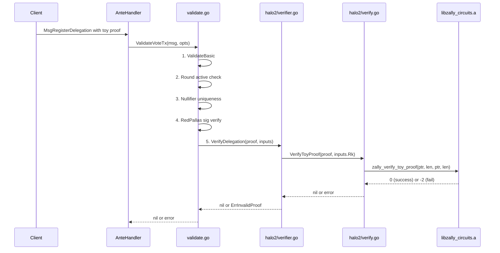

# Toy Proof Verification in the Ante Handler

## Current State

The pieces already exist but are disconnected:

- **Rust side**: `circuits/src/toy.rs` implements the toy circuit (`constant * a^2 * b^2 = c`), `circuits/src/ffi.rs` exports `zally_verify_toy_proof` over C FFI.
- **Go CGo wrapper**: `[crypto/zkp/halo2/verify.go](crypto/zkp/halo2/verify.go)` wraps the FFI behind `//go:build halo2` and exposes `VerifyToyProof(proof, publicInput []byte) error`.
- **ZKP Verifier interface**: `[crypto/zkp/verify.go](crypto/zkp/verify.go)` defines the `Verifier` interface with three methods (`VerifyDelegation`, `VerifyVoteCommitment`, `VerifyVoteShare`). The only implementation is `MockVerifier` (always succeeds).
- **Ante handler**: `[x/vote/ante/validate.go](x/vote/ante/validate.go)` calls `opts.ZKPVerifier.VerifyDelegation(...)` etc. during step 5 of validation.
- **App wiring**: `[app/app.go](app/app.go)` line 151 injects `zkp.NewMockVerifier()` into the ante handler options.

The toy circuit has no relation to the real delegation/vote/share circuits, so we need a way to slot it in temporarily as a proof-of-concept that the full pipeline (Rust -> CGo -> ante handler) works end-to-end.

## Approach

Repurpose **one of the three `Verifier` methods** (e.g., `VerifyDelegation`) to call the toy proof verifier when built with the `halo2` tag. This keeps the interface stable and tests the full CGo path through the ante handler without changing the message format.

### Convention for the toy proof

The `MsgRegisterDelegation.Proof` field will carry the serialized Halo2 toy proof bytes. We need to pass a public input -- we will derive it from a fixed convention: the first 32 bytes of the `DelegationInputs.Rk` field (which is already 32 bytes). This is purely for the toy demo; real circuits will use their actual public inputs.

## File Changes

### 1. New file: `crypto/zkp/halo2/verifier.go` (build tag: `halo2`)

Create a `Halo2Verifier` struct that implements `zkp.Verifier`:

```go
//go:build halo2

package halo2

import "github.com/z-cale/zally/crypto/zkp"

type Halo2Verifier struct{}

func NewVerifier() zkp.Verifier { return Halo2Verifier{} }

func (h Halo2Verifier) VerifyDelegation(proof []byte, inputs zkp.DelegationInputs) error {
    // For the toy demo: treat inputs.Rk (32 bytes) as the public input
    return VerifyToyProof(proof, inputs.Rk)
}

func (h Halo2Verifier) VerifyVoteCommitment(proof []byte, inputs zkp.VoteCommitmentInputs) error {
    return nil // mock -- real circuit not yet implemented
}

func (h Halo2Verifier) VerifyVoteShare(proof []byte, inputs zkp.VoteShareInputs) error {
    return nil // mock -- real circuit not yet implemented
}
```

This file only compiles with `-tags halo2`, so normal builds are unaffected.

### 2. New file: `crypto/zkp/halo2/verifier_default.go` (build tag: `!halo2`)

Provide a stub so code that imports `halo2.NewVerifier()` still compiles without the Rust library:

```go
//go:build !halo2

package halo2

import "github.com/z-cale/zally/crypto/zkp"

func NewVerifier() zkp.Verifier {
    return zkp.NewMockVerifier()
}
```

### 3. Update `[app/app.go](app/app.go)` (~line 151)

Replace the hardcoded mock with the build-tag-aware constructor:

```go
import halo2 "github.com/z-cale/zally/crypto/zkp/halo2"

// ...
ZKPVerifier: halo2.NewVerifier(),
```

When built normally (`go build`), `NewVerifier()` returns `MockVerifier`. When built with `go build -tags halo2`, it returns the real `Halo2Verifier` backed by Rust FFI.

### 4. New test: `x/vote/ante/validate_halo2_test.go` (build tag: `halo2`)

An integration test that runs the full ante validation pipeline with a real Halo2 proof:

- Load `crypto/zkp/testdata/toy_valid_proof.bin` and `toy_valid_input.bin` as fixtures.
- Construct a `MsgRegisterDelegation` where `Proof` = toy proof bytes and `Rk` = the 32-byte public input.
- Create `ValidateOpts` with `halo2.NewVerifier()` as the `ZKPVerifier`.
- Call `ValidateVoteTx(...)` and assert it succeeds.
- Also test with `toy_wrong_input.bin` to assert it fails with `ErrInvalidProof`.

### 5. Update Makefile

Add a new target that runs the ante handler halo2 test:

```makefile
## test-halo2-ante: Run ante handler tests with real Halo2 verification
test-halo2-ante: circuits
	go test -tags halo2 -count=1 -v ./x/vote/ante/... -run TestHalo2
```

Update the existing `test-halo2` target to also include the ante tests:

```makefile
test-halo2: circuits
	go test -tags halo2 -count=1 -v ./crypto/zkp/halo2/... ./x/vote/ante/...
```

### 6. Update CI (`[.github/workflows/ci.yml](.github/workflows/ci.yml)`)

Extend the `test-halo2` job's final step to run ante tests too (this happens automatically if we update the Makefile target above).

## Data Flow (end-to-end)




## What Does NOT Change

- The `zkp.Verifier` interface -- no new methods.
- The `ValidateOpts` struct -- same fields.
- The wire format / protobuf messages -- unchanged.
- The existing mock-only tests in `x/vote/ante/validate_test.go` -- they still compile and pass without the `halo2` tag.
- The `crypto/zkp/halo2/verify.go` CGo wrapper and `verify_test.go` -- untouched.

