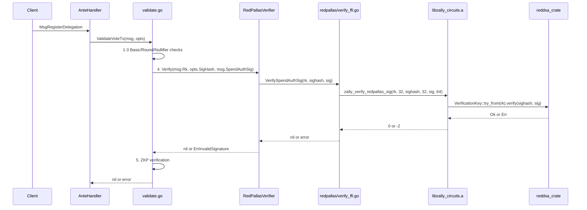

# RedPallas Signature Verification

## Current State

- **Interface**: `[crypto/redpallas/verify.go](crypto/redpallas/verify.go)` defines `Verifier` with `Verify(rk, sighash, sig []byte) error`. Only a `MockVerifier` (always succeeds) exists.
- **Ante handler**: `[x/vote/ante/validate.go](x/vote/ante/validate.go)` line 125 calls `opts.SigVerifier.Verify(msg.Rk, opts.SigHash, msg.SpendAuthSig)` -- already wired, but using the mock.
- **App wiring**: `[app/app.go](app/app.go)` line 150 injects `redpallas.NewMockVerifier()`.
- **Rust side**: No RedPallas code in `circuits/`. Only Halo2 toy circuit exists.
- **No tests** for the redpallas package at all.

## Approach

Follow the exact pattern established by the Halo2 toy proof (see [plans/toy_proof_ante_verification_92d10ff5.plan.md](plans/toy_proof_ante_verification_92d10ff5.plan.md)):

1. Implement verification in Rust using the ZCash Foundation's `reddsa` crate (`0.5.1`)
2. Export via C FFI from the existing `circuits` static library
3. Create Go CGo bindings with a `redpallas` build tag
4. Generate test fixtures (valid/invalid signatures)
5. Write Go tests at two levels: unit (crypto package) and integration (ante handler)
6. Wire the real verifier into `app/app.go` behind the build tag

### Build Tag Strategy

Use a **new `redpallas` build tag** (separate from `halo2`). Both tags link the same `libzally_circuits.a` static library, but they gate independent features:

- `go test -tags redpallas` -- runs RedPallas signature tests
- `go test -tags halo2` -- runs Halo2 ZKP tests
- `go test -tags "halo2 redpallas"` -- runs both

### Key Dimensions

- **rk** = 32 bytes (compressed Pallas point, the randomized verification key)
- **sighash** = 32 bytes (hash of the raw tx bytes)
- **sig** = 64 bytes (RedPallas SpendAuth signature)
- **Rust types**: `reddsa::VerificationKey<orchard::SpendAuth>`, `reddsa::Signature<orchard::SpendAuth>`

## File Changes

### Phase 1: Rust -- `reddsa` FFI

**1a. Update `[circuits/Cargo.toml](circuits/Cargo.toml)**`: Add `reddsa` dependency

```toml
reddsa = { version = "0.5", default-features = false }
```

**1b. New file `circuits/src/redpallas.rs**`: Verification wrapper

```rust
use reddsa::{orchard, Signature, VerificationKey};

pub fn verify_spend_auth_sig(
    rk_bytes: &[u8; 32],
    sighash: &[u8],
    sig_bytes: &[u8; 64],
) -> Result<(), reddsa::Error> {
    let vk = VerificationKey::<orchard::SpendAuth>::try_from(*rk_bytes)?;
    let sig = Signature::<orchard::SpendAuth>::from(*sig_bytes);
    vk.verify(sighash, &sig)
}
```

**1c. Update `[circuits/src/ffi.rs](circuits/src/ffi.rs)**`: Add new FFI export

```rust
#[no_mangle]
pub unsafe extern "C" fn zally_verify_redpallas_sig(
    rk_ptr: *const u8, rk_len: usize,          // must be 32
    sighash_ptr: *const u8, sighash_len: usize, // must be 32
    sig_ptr: *const u8, sig_len: usize,         // must be 64
) -> i32
```

Return codes: `0` success, `-1` invalid input, `-2` verification failed, `-3` deserialization error.

**1d. Update `[circuits/include/zally_circuits.h](circuits/include/zally_circuits.h)**`: Add C declaration

**1e. Update `[circuits/src/lib.rs](circuits/src/lib.rs)**`: Add `pub mod redpallas;`

### Phase 2: Fixture Generation

**2a. Extend `[circuits/tests/generate_fixtures.rs](circuits/tests/generate_fixtures.rs)**`: Generate RedPallas test data

Generate a valid (signing_key, rk, sighash, sig) tuple using `reddsa::SigningKey::<orchard::SpendAuth>::new(rng)` and write to `crypto/redpallas/testdata/`:

- `valid_rk.bin` -- 32 bytes (verification key)
- `valid_sighash.bin` -- 32 bytes (message hash)
- `valid_sig.bin` -- 64 bytes (valid signature)
- `wrong_sig.bin` -- 64 bytes (signature over a different message)

### Phase 3: Go CGo Wrapper

**3a. New file `crypto/redpallas/verify_ffi.go**` (build tag: `redpallas`):

CGo binding that calls `zally_verify_redpallas_sig`. Follows the same pattern as `[crypto/zkp/halo2/verify.go](crypto/zkp/halo2/verify.go)`:

```go
//go:build redpallas

package redpallas

/*
#cgo LDFLAGS: -L${SRCDIR}/../../circuits/target/release -lzally_circuits -ldl -lm -lpthread
#cgo darwin LDFLAGS: -framework Security -framework CoreFoundation
#include "../../circuits/include/zally_circuits.h"
*/
import "C"

func VerifySpendAuthSig(rk, sighash, sig []byte) error { ... }
```

### Phase 4: Go Unit Test (test-first)

**4a. New file `crypto/redpallas/verify_test.go**` (build tag: `redpallas`):

- `TestVerifyValidSignature` -- load fixtures, call `VerifySpendAuthSig`, assert success
- `TestVerifyWrongSignature` -- load wrong_sig fixture, assert error
- `TestVerifyBadInputs` -- empty/wrong-length inputs, assert error

### Phase 5: Go Verifier Implementation + Default Stub

**5a. New file `crypto/redpallas/verifier.go**` (build tag: `redpallas`):

```go
//go:build redpallas

package redpallas

type RedPallasVerifier struct{}

func NewVerifier() Verifier { return RedPallasVerifier{} }

func (v RedPallasVerifier) Verify(rk, sighash, sig []byte) error {
    return VerifySpendAuthSig(rk, sighash, sig)
}
```

**5b. New file `crypto/redpallas/verifier_default.go**` (build tag: `!redpallas`):

```go
//go:build !redpallas

package redpallas

func NewVerifier() Verifier { return MockVerifier{} }
```

**5c. Update `[crypto/redpallas/verify.go](crypto/redpallas/verify.go)**`: Remove `NewMockVerifier()` (replaced by `NewVerifier()` dispatching via build tag). Keep the `Verifier` interface and `MockVerifier` struct (still needed for tests and the default stub).

### Phase 6: Ante Handler Integration Test

**6a. New file `x/vote/ante/validate_redpallas_test.go**` (build tag: `redpallas`):

Following the pattern of `[x/vote/ante/validate_halo2_test.go](x/vote/ante/validate_halo2_test.go)`:

- `TestRedPallasDelegationValidSig` -- full ante pipeline with real signature, mock ZKP verifier
- `TestRedPallasDelegationWrongSig` -- full ante pipeline with invalid signature, assert `ErrInvalidSignature`

Uses real RedPallas fixtures for `msg.Rk`, `msg.SpendAuthSig`, and `opts.SigHash`.

### Phase 7: App Wiring

**7a. Update `[app/app.go](app/app.go)` line 150**:

```go
SigVerifier: redpallas.NewVerifier(),  // was: redpallas.NewMockVerifier()
```

When built normally, `NewVerifier()` returns `MockVerifier`. With `-tags redpallas`, it returns `RedPallasVerifier` backed by Rust FFI.

### Phase 8: Makefile

**8a. Update `[Makefile](Makefile)**`: Add RedPallas test targets

```makefile
## test-redpallas: Run Go tests with real RedPallas signature verification via CGo
test-redpallas: circuits
	go test -tags redpallas -count=1 -v ./crypto/redpallas/... ./x/vote/ante/...

## test-all-ffi: Run all FFI-backed tests (Halo2 + RedPallas)
test-all-ffi: circuits
	go test -tags "halo2 redpallas" -count=1 -v ./crypto/... ./x/vote/ante/...
```

Update the `fixtures` target to also generate RedPallas fixtures.

## Data Flow (end-to-end)




## What Does NOT Change

- The `redpallas.Verifier` interface -- same signature
- The `ValidateOpts` struct -- same fields
- The protobuf messages / wire format
- Existing mock-only tests in `validate_test.go` -- still pass without the `redpallas` tag
- The Halo2 CGo wrapper and tests -- independent build tag

