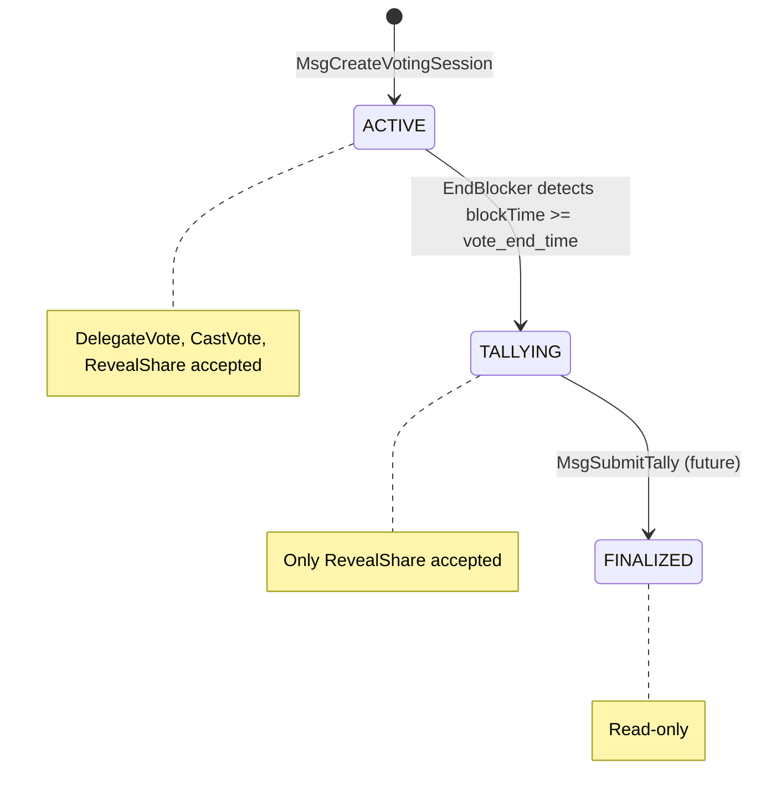

# VotingSession Status Lifecycle

## Problem

`VoteRound` has no `status` field. The chain derives "active vs expired" from a timestamp comparison in `ValidateRoundActive` (`blockTime < vote_end_time`). This means:

- There is no `TALLYING` state — once `vote_end_time` passes, ALL messages are rejected, including `MsgRevealShare` which the spec says should still be accepted.
- There is no `FINALIZED` state to gate future `MsgSubmitTally`.
- There is no on-chain event marking when a round transitions between states.

## Design




## Changes

### 1. Proto: Add `SessionStatus` enum and `status` field

In [sdk/proto/zvote/v1/types.proto](sdk/proto/zvote/v1/types.proto):

- Add enum before `VoteRound`:

```protobuf
enum SessionStatus {
  SESSION_STATUS_UNSPECIFIED = 0;
  SESSION_STATUS_ACTIVE      = 1;
  SESSION_STATUS_TALLYING    = 2;
  SESSION_STATUS_FINALIZED   = 3;
}
```

- Add field to `VoteRound`:

```protobuf
message VoteRound {
  // ... existing fields 1-8 ...
  SessionStatus status = 9;
}
```

- Regenerate protobuf.

### 2. New error sentinel and event type

In [sdk/x/vote/types/errors.go](sdk/x/vote/types/errors.go), add:

```go
ErrRoundNotTallying = errors.Register(ModuleName, 12, "vote round is not in tallying state")
```

In [sdk/x/vote/types/events.go](sdk/x/vote/types/events.go), add:

```go
EventTypeRoundStatusChange = "round_status_change"
AttributeKeyOldStatus      = "old_status"
AttributeKeyNewStatus      = "new_status"
```

### 3. Keeper: round iteration and status-aware validation

In [sdk/x/vote/keeper/keeper.go](sdk/x/vote/keeper/keeper.go):

- Add `UpdateVoteRoundStatus(kvStore, roundID, newStatus)` — reads round, sets status, writes back.
- Add `IterateActiveRounds(kvStore, callback)` — prefix-iterates over `VoteRoundPrefix`, unmarshals each `VoteRound`, calls `callback` for those with `status == SESSION_STATUS_ACTIVE`. (Fine for expected cardinality of a few concurrent rounds.)
- Rename `ValidateRoundActive` to `ValidateRoundForVoting` — checks: round exists, `status == ACTIVE`, and `blockTime < vote_end_time` (belt-and-suspenders; EndBlocker may not have run yet this block).
- Add `ValidateRoundForShares(ctx, roundID)` — checks: round exists, `status == ACTIVE || TALLYING`. When ACTIVE, also checks `blockTime < vote_end_time`. When TALLYING, the round is accepted (the spec's grace-period concept; shares are accepted as long as the round hasn't been finalized).
- Keep the old `ValidateRoundActive` as a thin wrapper around `ValidateRoundForVoting` to minimize churn, or remove it entirely and update all callers.

### 4. VoteMessage interface: `AcceptsTallyingRound()`

In [sdk/x/vote/types/msgs.go](sdk/x/vote/types/msgs.go), add to the `VoteMessage` interface:

```go
AcceptsTallyingRound() bool
```

Implementations:

- `MsgDelegateVote.AcceptsTallyingRound()` returns `false`
- `MsgCastVote.AcceptsTallyingRound()` returns `false`
- `MsgRevealShare.AcceptsTallyingRound()` returns `true`
- `MsgCreateVotingSession.AcceptsTallyingRound()` returns `false`

### 5. Ante handler: message-type-aware round check

In [sdk/x/vote/ante/validate.go](sdk/x/vote/ante/validate.go), update step 2:

```go
if roundID := msg.GetVoteRoundId(); roundID != nil {
    if msg.AcceptsTallyingRound() {
        if err := k.ValidateRoundForShares(ctx, roundID); err != nil {
            return err
        }
    } else {
        if err := k.ValidateRoundForVoting(ctx, roundID); err != nil {
            return err
        }
    }
}
```

### 6. MsgCreateVotingSession: set initial status

In [sdk/x/vote/keeper/msg_server.go](sdk/x/vote/keeper/msg_server.go), in `CreateVotingSession`, set `Status: types.SessionStatus_SESSION_STATUS_ACTIVE` on the new `VoteRound`.

### 7. EndBlocker: automatic ACTIVE to TALLYING transition

In [sdk/x/vote/module.go](sdk/x/vote/module.go), extend `EndBlock` (after the existing tree-root logic) to:

1. Call `keeper.IterateActiveRounds(kvStore, ...)`.
2. For each round where `blockTime >= round.VoteEndTime`, call `UpdateVoteRoundStatus` to set `TALLYING`.
3. Emit a `round_status_change` event with `old_status=ACTIVE`, `new_status=TALLYING`, and the `round_id`.

### 8. Genesis: persist and restore status

The `VoteRound` proto already includes the new `status` field, so `InitGenesis`/`ExportGenesis` (which serialize the full `VoteRound` protobuf) will automatically handle it — no extra code needed.

### 9. Update tests

**[sdk/x/vote/keeper/keeper_test.go](sdk/x/vote/keeper/keeper_test.go):**

- Rename `TestValidateRoundActive` to `TestValidateRoundForVoting`.
- Add `TestValidateRoundForShares` — test that ACTIVE and TALLYING rounds are accepted, FINALIZED and missing rounds are rejected.
- Add `TestIterateActiveRounds` — stores multiple rounds with different statuses, verifies only ACTIVE rounds are yielded.
- Add `TestUpdateVoteRoundStatus` — verify status is persisted correctly.
- Update all `setupActiveRound` / round creation to include `Status: SESSION_STATUS_ACTIVE`.

**[sdk/x/vote/ante/validate_test.go](sdk/x/vote/ante/validate_test.go):**

- Update `setupActiveRound` and `setupExpiredRound` to set the `Status` field. `setupExpiredRound` sets `ACTIVE` status with an expired `vote_end_time` (simulating pre-EndBlocker state).
- Add `setupTallyingRound` helper — sets `Status: TALLYING`.
- Add test: `MsgRevealShare` with TALLYING round succeeds.
- Add test: `MsgDelegateVote` with TALLYING round fails.
- Add test: `MsgCastVote` with TALLYING round fails.

**[sdk/x/vote/keeper/msg_server_test.go](sdk/x/vote/keeper/msg_server_test.go):**

- Update `setupActiveRound` to include `Status: SESSION_STATUS_ACTIVE`.

**[sdk/app/abci_test.go](sdk/app/abci_test.go):**

- Add integration test: create round, advance time past `vote_end_time`, deliver a block (triggers EndBlocker), verify round status is `TALLYING`.
- Add integration test: after transition to TALLYING, `MsgRevealShare` still succeeds while `MsgDelegateVote` fails.

**New EndBlocker test (in `sdk/x/vote/module_test.go` or `sdk/app/abci_test.go`):**

- Create two rounds: one active (future end time) and one expired (past end time). Run EndBlocker. Verify only the expired one transitions to TALLYING.

### 10. Documentation: session status lifecycle

Create [docs/session-status-lifecycle.md](docs/session-status-lifecycle.md) documenting:

- **State machine diagram** (Mermaid) showing UNSPECIFIED, ACTIVE, TALLYING, FINALIZED states and all transitions.
- **Per-status rules table**: which messages are accepted/rejected in each status, and what triggers each transition.
- **Transition details**: who triggers each transition (EndBlocker for ACTIVE->TALLYING, MsgSubmitTally for TALLYING->FINALIZED), the conditions checked, and the events emitted.
- **Belt-and-suspenders note**: explain that `ValidateRoundForVoting` checks both the persistent `status` field AND `blockTime < vote_end_time` to guard against the window between `vote_end_time` passing and the next EndBlocker run.
- **FINALIZED placeholder**: note that FINALIZED is defined in the enum but the transition is not yet implemented (pending `MsgSubmitTally` work).

