# Add Missing Session Fields to VoteRound and MsgCreateVotingSession

## Motivation

The spec requires `ea_pk`, `vk_zkp1`, `vk_zkp2`, `vk_zkp3`, and `repeated Proposal proposals` on both `MsgCreateVotingSession` and `VotingSession` (stored as `VoteRound`). These are entirely absent from the implementation. Without them:

- El Gamal encryption cannot be parameterized (no `ea_pk`)
- ZKP verification cannot be parameterized per-session (no `vk_zkp*`)
- `proposal_id` cannot be validated against a proposals list
- ZKP public inputs are missing `nc_root` and `nullifier_imt_root` from the session

## Prerequisite: Fix Merge Conflict

[sdk/x/vote/types/msgs.go](sdk/x/vote/types/msgs.go) lines 120-127 have unresolved merge markers. The `VoteMessage` interface needs both `AcceptsTallyingRound()` and `GetNullifierType()`. Resolve by keeping both methods in the interface.

## Approach: Test-First, Layer-by-Layer

All changes follow the existing patterns:

- **Unit tests**: testify suite in `_test.go` sibling files, table-driven
- **Integration tests**: `ABCIIntegrationSuite` in [sdk/app/abci_test.go](sdk/app/abci_test.go)
- **Test helpers**: [sdk/testutil/fixtures.go](sdk/testutil/fixtures.go)

```mermaid
flowchart LR
    subgraph proto [Proto Layer]
        P1[Proposal message]
        P2[VoteRound fields]
        P3[MsgCreateVotingSession fields]
    end
    subgraph validation [Validation Layer]
        V1[ValidateBasic]
        V2[ZKP public inputs]
    end
    subgraph keeper [Keeper Layer]
        K1[msg_server: store new fields]
        K2[proposal_id validation helper]
    end
    subgraph tests [Test Layer]
        T1[ValidateBasic tests]
        T2[msg_server tests]
        T3[ante pipeline tests]
        T4[ABCI integration tests]
    end
    proto --> validation --> keeper --> tests
```




## 1. Proto Changes

### [sdk/proto/zvote/v1/types.proto](sdk/proto/zvote/v1/types.proto)

Add `Proposal` message and new fields to `VoteRound`:

```protobuf
message Proposal {
  uint32 id          = 1;
  string title       = 2;
  string description = 3;
}

message VoteRound {
  // ... existing fields 1-9 ...
  bytes  ea_pk    = 10;  // Election authority public key (Pallas, 32 bytes)
  bytes  vk_zkp1  = 11;  // Verification key for ZKP #1
  bytes  vk_zkp2  = 12;  // Verification key for ZKP #2
  bytes  vk_zkp3  = 13;  // Verification key for ZKP #3
  repeated Proposal proposals = 14;
}
```

### [sdk/proto/zvote/v1/tx.proto](sdk/proto/zvote/v1/tx.proto)

Add same fields to `MsgCreateVotingSession`:

```protobuf
message MsgCreateVotingSession {
  // ... existing fields 1-7 ...
  bytes  ea_pk    = 8;
  bytes  vk_zkp1  = 9;
  bytes  vk_zkp2  = 10;
  bytes  vk_zkp3  = 11;
  repeated Proposal proposals = 12;
}
```

Note: `proposals_hash` (field 4) is retained because it feeds into `deriveRoundID`. Validation will ensure `hash(proposals) == proposals_hash`.

### Regenerate

Run `cd sdk/proto && buf generate` to regenerate `types.pb.go` and `tx.pb.go`.

## 2. ValidateBasic Additions

In [sdk/x/vote/types/msgs.go](sdk/x/vote/types/msgs.go), extend `MsgCreateVotingSession.ValidateBasic()`:

- `ea_pk` must be exactly 32 bytes (compressed Pallas point)
- `vk_zkp1`, `vk_zkp2`, `vk_zkp3` must be non-empty
- `proposals` length must be in [1, 16]
- Each proposal must have a non-empty `title`
- Proposal IDs must be 0-indexed and sequential (id == index)

### Tests to write first (in existing `validate_test.go` table):

- `invalid: empty ea_pk` -> `"ea_pk"`
- `invalid: ea_pk wrong length` -> `"ea_pk must be 32 bytes"`
- `invalid: empty vk_zkp1` -> `"vk_zkp1"`
- `invalid: empty vk_zkp2` -> `"vk_zkp2"`
- `invalid: empty vk_zkp3` -> `"vk_zkp3"`
- `invalid: zero proposals` -> `"proposals"`
- `invalid: 17 proposals` -> `"proposals"`
- `invalid: proposal with empty title` -> `"title"`
- `invalid: proposal ID mismatch` -> `"proposal id"`

## 3. Keeper: Store New Fields

### [sdk/x/vote/keeper/msg_server.go](sdk/x/vote/keeper/msg_server.go)

`CreateVotingSession` handler: copy `EaPk`, `VkZkp1`, `VkZkp2`, `VkZkp3`, and `Proposals` from the message into the `VoteRound` before storing.

### [sdk/x/vote/keeper/msg_server.go](sdk/x/vote/keeper/msg_server.go) — `CastVote` and `RevealShare`

Add `proposal_id < len(session.proposals)` validation (the keeper already fetches the round for anchor validation in `CastVote`; `RevealShare` does not currently fetch it in the handler but the ante pipeline does).

### Keeper helper

Add `ValidateProposalId(ctx, roundID, proposalId)` to the keeper for reuse in both the ante handler and msg_server.

### Tests to write first:

In [sdk/x/vote/keeper/msg_server_test.go](sdk/x/vote/keeper/msg_server_test.go):

- `TestCreateVotingSession`: extend happy-path `checkResp` to verify `round.EaPk`, `round.VkZkp1`, `round.Proposals` are stored correctly
- New case: `"stored proposals match message proposals"`
- For CastVote: `"invalid proposal_id rejected"` (proposal_id >= len(proposals))
- For RevealShare: `"invalid proposal_id rejected"`

## 4. ZKP Public Inputs: Wire Session-Derived Values

### [sdk/crypto/zkp/verify.go](sdk/crypto/zkp/verify.go)

Add `NcRoot` and `NullifierImtRoot` to `DelegationInputs`:

```go
type DelegationInputs struct {
    // ... existing fields ...
    NcRoot             []byte  // from session state
    NullifierImtRoot   []byte  // from session state
}
```

### [sdk/x/vote/ante/validate.go](sdk/x/vote/ante/validate.go)

`verifyDelegation` currently does not look up the session. Change it to accept session data (or look up the round) and pass `nc_root` and `nullifier_imt_root` to the ZKP verifier.

**Design choice**: The ante handler already validates the round in step 2. To avoid a second KV read, refactor `ValidateVoteTx` to pass the fetched round data downstream. Alternatively, accept a small performance cost and re-read in `verifyDelegation`. Given this is a one-time read per tx, the simpler approach (re-read) is fine.

### Tests to write first:

In [sdk/x/vote/ante/validate_test.go](sdk/x/vote/ante/validate_test.go):

- Verify the ZKP verifier receives `NcRoot` and `NullifierImtRoot` by adding a spy verifier that captures inputs and asserts they match the stored round values.

## 5. Test Fixtures and Helpers

### [sdk/testutil/fixtures.go](sdk/testutil/fixtures.go)

Update all helper functions to include the new fields:

- `ValidCreateVotingSession()` / `ValidCreateVotingSessionAt()` / `ExpiredCreateVotingSessionAt()`: add `ea_pk`, `vk_zkp*`, and 2 sample proposals
- Ensure `proposals_hash` still works for `deriveRoundID`

### [sdk/x/vote/keeper/msg_server_test.go](sdk/x/vote/keeper/msg_server_test.go)

Update `validSetupMsg()` to include new fields.

### [sdk/x/vote/ante/validate_test.go](sdk/x/vote/ante/validate_test.go)

Update `newValidMsgCreateVotingSession()` and `setupRound`/`setupRoundWithStatus` helpers to populate new VoteRound fields.

## 6. Integration Tests

### [sdk/app/abci_test.go](sdk/app/abci_test.go)

Existing tests will need updated fixtures (from step 5). Add one new integration test:

- `TestProposalIdValidation`: Create session with 2 proposals, then submit CastVote/RevealShare with `proposal_id = 5` and verify rejection

## File Change Summary

- **Proto** (2 files): [sdk/proto/zvote/v1/types.proto](sdk/proto/zvote/v1/types.proto), [sdk/proto/zvote/v1/tx.proto](sdk/proto/zvote/v1/tx.proto)
- **Generated** (2 files): `types.pb.go`, `tx.pb.go` (regenerated)
- **Validation** (1 file): [sdk/x/vote/types/msgs.go](sdk/x/vote/types/msgs.go) (fix merge conflict + new validations)
- **Keeper** (1 file): [sdk/x/vote/keeper/msg_server.go](sdk/x/vote/keeper/msg_server.go) (store new fields, proposal_id validation)
- **Keeper** (1 file): [sdk/x/vote/keeper/keeper.go](sdk/x/vote/keeper/keeper.go) (ValidateProposalId helper)
- **Ante** (1 file): [sdk/x/vote/ante/validate.go](sdk/x/vote/ante/validate.go) (session-derived ZKP inputs)
- **ZKP interface** (1 file): [sdk/crypto/zkp/verify.go](sdk/crypto/zkp/verify.go) (DelegationInputs fields)
- **Tests** (4 files): `validate_test.go`, `msg_server_test.go`, `abci_test.go`, `fixtures.go`
- **Genesis** (1 file): [sdk/x/vote/keeper/genesis.go](sdk/x/vote/keeper/genesis.go) (no logic change, but round-trip test should cover new fields)

