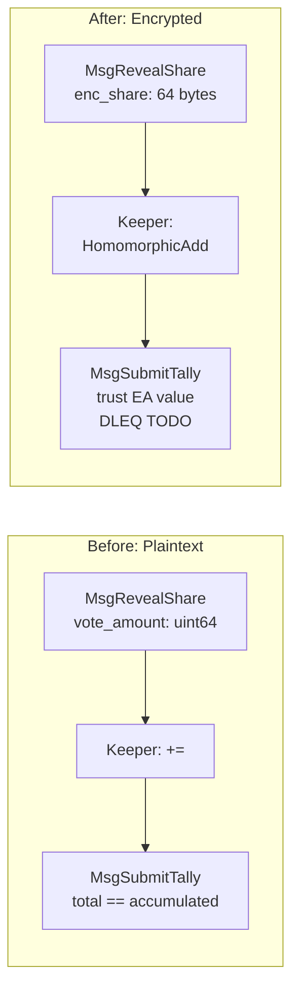

# Wire El Gamal + BSGS Into On-Chain Tally (Stub DLEQ)

## What Changes

The tally pipeline currently uses `uint64` addition: `MsgRevealShare` sends a plaintext `vote_amount`, the keeper does `+=`, and `MsgSubmitTally` compares against the stored sum. This plan replaces it with El Gamal ciphertext accumulation: `MsgRevealShare` sends 64 bytes of encrypted share, the keeper does `HomomorphicAdd`, and `MsgSubmitTally` trusts the EA's decrypted value (DLEQ stubbed).




## Step 1: Ciphertext Serialization

**New file**: [sdk/crypto/elgamal/serialize.go](sdk/crypto/elgamal/serialize.go)

```go
// MarshalCiphertext serializes (C1, C2) to 64 bytes (two 32-byte compressed Pallas points).
func MarshalCiphertext(ct *Ciphertext) ([]byte, error)

// UnmarshalCiphertext deserializes 64 bytes back into a Ciphertext.
func UnmarshalCiphertext(data []byte) (*Ciphertext, error)

// IdentityCiphertextBytes returns 64 bytes representing Enc(0) = (O, O).
// Used as the initial accumulator value.
func IdentityCiphertextBytes() []byte
```

**New file**: [sdk/crypto/elgamal/serialize_test.go](sdk/crypto/elgamal/serialize_test.go)

- Round-trip: marshal then unmarshal preserves C1, C2
- Identity ciphertext round-trips correctly
- Wrong-length input returns error
- Random ciphertext round-trip with HomomorphicAdd

## Step 2: Proto Changes

**File**: [sdk/proto/zvote/v1/tx.proto](sdk/proto/zvote/v1/tx.proto)

Change `MsgRevealShare` field 2:

```protobuf
// Before:
uint64 vote_amount = 2;
// After:
bytes  enc_share   = 2;  // 64 bytes: ElGamal ciphertext (C1 || C2, compressed Pallas points)
```

**File**: [sdk/proto/zvote/v1/query.proto](sdk/proto/zvote/v1/query.proto)

Change `QueryProposalTallyResponse`:

```protobuf
// Before:
map<uint32, uint64> tally = 1;
// After:
map<uint32, bytes> tally = 1;  // decision -> serialized ElGamal ciphertext (64 bytes)
```

Then regenerate Go code from proto (or manually patch `tx.pb.go` and `query.pb.go` since the field name/type change is small).

## Step 3: Keeper Tally Methods

**File**: [sdk/x/vote/keeper/keeper.go](sdk/x/vote/keeper/keeper.go)

Update the KV layout comment:

```
// 0x05 || round_id || proposal_id || decision -> []byte (64 bytes: ElGamal ciphertext)
```

Rewrite `AddToTally`:

```go
func (k Keeper) AddToTally(kvStore store.KVStore, roundID []byte, proposalID, decision uint32, encShareBytes []byte) error {
    key := types.TallyKey(roundID, proposalID, decision)
    existing, _ := kvStore.Get(key)

    if existing == nil {
        // First share: store directly (identity + X = X)
        return kvStore.Set(key, encShareBytes)
    }

    // Deserialize both, HomomorphicAdd, serialize result
    acc, err := elgamal.UnmarshalCiphertext(existing)
    share, err := elgamal.UnmarshalCiphertext(encShareBytes)
    result := elgamal.HomomorphicAdd(acc, share)
    resultBytes, err := elgamal.MarshalCiphertext(result)
    return kvStore.Set(key, resultBytes)
}
```

Rewrite `GetTally` to return `[]byte`:

```go
func (k Keeper) GetTally(kvStore store.KVStore, roundID []byte, proposalID, decision uint32) ([]byte, error)
```

Rewrite `GetProposalTally` to return `map[uint32][]byte`:

```go
func (k Keeper) GetProposalTally(kvStore store.KVStore, roundID []byte, proposalID uint32) (map[uint32][]byte, error)
```

## Step 4: Msg Server Updates

**File**: [sdk/x/vote/keeper/msg_server.go](sdk/x/vote/keeper/msg_server.go)

`RevealShare` handler -- use `msg.EncShare` instead of `msg.VoteAmount`:

```go
// Line ~175: change from:
if err := ms.k.AddToTally(kvStore, msg.VoteRoundId, msg.ProposalId, msg.VoteDecision, msg.VoteAmount); err != nil {
// to:
if err := ms.k.AddToTally(kvStore, msg.VoteRoundId, msg.ProposalId, msg.VoteDecision, msg.EncShare); err != nil {
```

Update event emission: remove `AttributeKeyVoteAmount`, replace with encrypted share info.

`SubmitTally` handler -- stub DLEQ verification:

```go
// Line ~227-230: replace plaintext comparison with TODO stub:
// TODO(dleq): Verify Chaum-Pedersen DLEQ proof that total_value matches
// the encrypted accumulator. For now, trust the EA's claimed value since
// MsgSubmitTally is authority-gated (only session creator can submit).
// Future: Use elgamal.VerifyDLEQ(entry.DecryptionProof, session.EaPk, accumulatorC1, ...)
```

## Step 5: Validation Updates

**File**: [sdk/x/vote/types/msgs.go](sdk/x/vote/types/msgs.go)

`MsgRevealShare.ValidateBasic()` -- change from `VoteAmount > 0` to `len(EncShare) == 64`:

```go
// Before:
if msg.VoteAmount == 0 { return fmt.Errorf("vote_amount cannot be zero") }
// After:
if len(msg.EncShare) != 64 { return fmt.Errorf("enc_share must be 64 bytes (ElGamal ciphertext), got %d", len(msg.EncShare)) }
```

**File**: [sdk/crypto/zkp/verify.go](sdk/crypto/zkp/verify.go)

Update `VoteShareInputs`:

```go
// Before:
VoteAmount     uint64
// After:
EncShare       []byte // 64 bytes: ElGamal ciphertext
```

**File**: [sdk/x/vote/ante/validate.go](sdk/x/vote/ante/validate.go)

In `verifyRevealShare`, change `VoteAmount: msg.VoteAmount` to `EncShare: msg.EncShare`.

## Step 6: Query Server Updates

**File**: [sdk/x/vote/keeper/query_server.go](sdk/x/vote/keeper/query_server.go)

`ProposalTally` handler: return `map[uint32][]byte` matching the updated proto.

## Step 7: Event Cleanup

**File**: [sdk/x/vote/types/events.go](sdk/x/vote/types/events.go)

Remove or rename `AttributeKeyVoteAmount`. The `RevealShare` event should emit `proposal_id`, `vote_decision`, and `share_nullifier` (the encrypted share is too large for event attributes).

## Step 8: Update All Tests

### Keeper tests ([sdk/x/vote/keeper/msg_server_test.go](sdk/x/vote/keeper/msg_server_test.go))

- `TestRevealShare`: Replace `VoteAmount: 500` with `EncShare: <64-byte ciphertext>`. Use `elgamal.Encrypt` + `elgamal.MarshalCiphertext` to generate valid test ciphertexts.
- `TestRevealShare` accumulation test: Verify HomomorphicAdd by encrypting two known values, accumulating, then checking the stored ciphertext bytes.
- `TestSubmitTally`: Remove `total_value == accumulated` check expectations. Verify the round transitions to FINALIZED and results are stored (TallyResult still stores uint64 `total_value` from the EA).

### Keeper tally tests ([sdk/x/vote/keeper/keeper_test.go](sdk/x/vote/keeper/keeper_test.go))

- Update `AddToTally` / `GetTally` tests to use 64-byte ciphertext inputs.

### Query tests ([sdk/x/vote/keeper/query_server_test.go](sdk/x/vote/keeper/query_server_test.go))

- `TestProposalTally_WithVotes`: Change from `uint64(100)` assertions to `[]byte` ciphertext assertions.
- `TestProposalTally_AccumulatesMultipleAdds`: Verify ciphertext accumulation.

### Ante tests ([sdk/x/vote/ante/validate_test.go](sdk/x/vote/ante/validate_test.go))

- `newValidMsgRevealShare()`: Replace `VoteAmount: 1000` with `EncShare: bytes.Repeat([]byte{0x88}, 64)`.
- Update `"invalid: zero vote_amount"` test to `"invalid: wrong enc_share length"`.

### TypeScript E2E tests ([sdk/tests/api/src/helpers.ts](sdk/tests/api/src/helpers.ts), [sdk/tests/api/src/voting-flow.test.ts](sdk/tests/api/src/voting-flow.test.ts))

- Replace `vote_amount: number` with `enc_share: string` (base64-encoded 64 bytes).
- Update all test payloads that use `voteAmount`.

## Key Design Decisions

- **First share optimization**: When no accumulator exists for a `(round, proposal, decision)` key, store the incoming ciphertext directly rather than HomomorphicAdd with an identity element. Avoids needing to construct identity points at storage time.
- **SubmitTally trust model**: The EA's `total_value` is accepted without cryptographic verification. This is safe during development because `MsgSubmitTally` is already authority-gated (only the session `creator` can submit). DLEQ drops in later as a single verification function.
- **Proto field numbers preserved**: Field 2 of `MsgRevealShare` changes from `uint64` to `bytes` but keeps the same number. This is a wire-incompatible change, acceptable since no mainnet data exists.
- **TallyResult stays uint64**: The finalized `TallyResult` proto still stores `uint64 total_value` since that's the decrypted plaintext provided by the EA.

