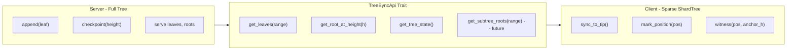

# Vote Commitment Tree: Client-Server Split POC

## Current State

Everything lives in a single `VoteCommitmentTree` struct in `[vote-commitment-tree/src/tree.rs](vote-commitment-tree/src/tree.rs)` that mixes server concerns (append, checkpoint, root storage) with client concerns (witness generation, path queries). The goal is to split these into distinct abstractions with a clear communication boundary.

## Architecture




### Three Layers

**1. Shared types** -- extracted from current `tree.rs`, used by both server and client:

- `MerkleHashVote` (implements `Hashable` with Poseidon)
- `Anchor`, `MerklePath`
- `EMPTY_ROOTS`, `TREE_DEPTH`, `SHARD_HEIGHT` constants

**2. Server** (`TreeServer`) -- owns the authoritative full tree:

- Wraps `ShardTree<MemoryShardStore, 32, 4>` (POC; in production, the Go keeper owns persistence)
- `append(leaf) -> u64` -- append from `MsgDelegateVote` / `MsgCastVote`
- `checkpoint(height)` -- EndBlocker root snapshot
- `root_at_height(h)` -- anchor lookup
- Implements `TreeSyncApi` to serve data to clients

**3. Client** (`TreeClient`) -- owns a sparse local copy for witness generation:

- Wraps its own `ShardTree<MemoryShardStore, 32, 4>`
- `sync(&dyn TreeSyncApi)` -- fetch leaves from server, insert, checkpoint
- `mark_position(pos)` -- mark a leaf for future witness generation (your own VAN or VC)
- `witness(pos, anchor_height) -> Option<MerklePath>` -- generate Merkle path
- `root_at_height(h)` -- verify anchor matches server

### The Sync API Trait (Communication Boundary)

```rust
/// Response from get_leaves: a batch of sequential leaves with their starting index.
pub struct LeafBatch {
    pub start_index: u64,
    pub leaves: Vec<MerkleHashVote>,
}

/// Block-level metadata: which leaves were appended in a given block.
pub struct BlockCommitments {
    pub height: u32,
    pub start_index: u64,
    pub leaves: Vec<MerkleHashVote>,
}

/// Current state of the server tree.
pub struct TreeState {
    pub next_index: u64,
    pub root: Fp,
    pub height: u32,
}

/// The contract between server and client.
/// In the POC: in-process trait object.
/// In production: maps to Cosmos SDK gRPC/REST endpoints.
pub trait TreeSyncApi {
    type Error;

    /// Fetch commitments per block in a height range (primary sync method).
    /// Maps to: custom compact-block endpoint or Tendermint block queries.
    fn get_block_commitments(&self, from_height: u32, to_height: u32)
        -> Result<Vec<BlockCommitments>, Self::Error>;

    /// Fetch tree root at a checkpoint height (anchor verification).
    /// Maps to: GET /zally/v1/commitment-tree/{height}
    fn get_root_at_height(&self, height: u32) -> Result<Option<Fp>, Self::Error>;

    /// Fetch current tree state (next_index, root, latest height).
    /// Maps to: GET /zally/v1/commitment-tree/latest
    fn get_tree_state(&self) -> Result<TreeState, Self::Error>;
}
```

### How This Maps to Production Targets

- **Zashi (librustzcash)**: `TreeClient` becomes a vote-chain equivalent of `WalletCommitmentTrees`. The pattern in `[zcash_client_memory/src/wallet_commitment_trees.rs](librustzcash/zcash_client_memory/src/wallet_commitment_trees.rs)` -- `with_sapling_tree_mut`, `put_sapling_subtree_roots` -- is exactly the pattern `TreeClient` follows. The `TreeSyncApi` calls become lightwalletd-style RPCs against the vote chain.
- **Cosmos SDK chain**: `TreeServer` logic maps to the existing keeper in `[sdk/x/vote/keeper/keeper.go](sdk/x/vote/keeper/keeper.go)` which already has `AppendCommitment`, `ComputeTreeRoot`, `GetCommitmentRootAtHeight`. The `TreeSyncApi` endpoints map to the existing REST routes in `[sdk/api/query_handler.go](sdk/api/query_handler.go)` plus a new endpoint to serve leaf batches per block.

## Module Layout

```
vote-commitment-tree/src/
  lib.rs          -- re-exports shared types + server + client + sync_api
  hash.rs         -- MerkleHashVote, Hashable impl, EMPTY_ROOTS (extracted from tree.rs)
  anchor.rs       -- Anchor type (extracted from tree.rs)
  path.rs         -- MerklePath type (extracted from tree.rs)
  sync_api.rs     -- TreeSyncApi trait, LeafBatch, BlockCommitments, TreeState
  server.rs       -- TreeServer: full tree, append, checkpoint, implements TreeSyncApi
  client.rs       -- TreeClient: sparse ShardTree, sync, mark, witness
```

## Integration Test

A single test in `server.rs` or a dedicated test module that proves the full interaction:

```
1. Create TreeServer (empty)
2. Simulate MsgDelegateVote: server.append(van_alice), server.checkpoint(1)
3. Simulate MsgCastVote: server.append_two(new_van_alice, vc_alice), server.checkpoint(2)
4. Create TreeClient (empty)
5. Client syncs from server via TreeSyncApi: fetches block commitments, inserts leaves, checkpoints
6. Client marks position 0 (alice's VAN) -- she needs a witness for ZKP #2
7. Client generates witness at anchor height 1
8. Assert: witness verifies against server's root at height 1
9. Client syncs block 2 (new VAN + VC appended)
10. Client marks position 3 (VC) -- helper server needs this for ZKP #3
11. Client generates witness at anchor height 2
12. Assert: witness verifies against server's root at height 2
```

This proves: server appends continuously, client syncs incrementally, witnesses are correct across sync boundaries.

## Fast Sync Optimization (Future -- Not in POC)

### Problem

A client joining late (or the helper server bootstrapping for ZKP #3) must replay every leaf from genesis to build a correct ShardTree. With millions of votes, this is slow.

### Solution: Pre-computed Subtree Roots

This is the same optimization Zcash's lightwalletd uses for wallet fast-sync (`put_orchard_subtree_roots`).

**How it works:**

The tree has `SHARD_HEIGHT = 4`, so each shard covers `2^4 = 16` leaves. Once a shard is full (all 16 leaf positions filled), its root hash is deterministic and never changes (append-only tree). The server can pre-compute and cache these.

```
Tree depth 32, shard height 4:
  - Shard 0: leaves [0..15]   -> subtree_root_0
  - Shard 1: leaves [16..31]  -> subtree_root_1
  - Shard N: leaves [16N..16N+15] -> subtree_root_N
```

**Server addition** -- new method on `TreeSyncApi`:

```rust
pub struct SubtreeRoot {
    pub shard_index: u64,
    pub root_hash: MerkleHashVote,
    pub containing_height: u32,  // block height when this shard was completed
}

/// Extension to TreeSyncApi for fast sync:
fn get_subtree_roots(&self, start_shard: u64, end_shard: u64)
    -> Result<Vec<SubtreeRoot>, Self::Error>;
```

**Client fast-sync flow:**

```
1. Client asks: get_tree_state() -> knows tip is at index 1,000,000
2. Client asks: get_subtree_roots(0, 62499) -> gets roots for shards 0..62499
   (each covers 16 leaves; 62500 shards = 1,000,000 leaves)
3. Client inserts subtree roots at shard-level addresses:
   tree.insert(Address::from_parts(SHARD_HEIGHT, shard_index), root_hash)
   (same as librustzcash's put_orchard_subtree_roots)
4. For the partial final shard (if tree size not aligned to 16): client fetches
   individual leaves via get_block_commitments() for the last partial shard
5. Client now has a valid tree without replaying every leaf
6. Client can generate witnesses for any marked position
```

**Why this works:** ShardTree is designed for exactly this. It stores the "cap" (upper tree levels) and individual shards. Inserting a subtree root fills an entire shard with a single hash -- the tree can still compute correct roots and witnesses for marked positions within that shard, provided the marked positions have their leaf data.

**Bandwidth comparison:**

- Full sync: `1,000,000 leaves x 32 bytes = ~32 MB`
- Fast sync: `62,500 subtree roots x 32 bytes = ~2 MB` (16x reduction)

**Cosmos SDK endpoint:** Add `GET /zally/v1/commitment-tree/subtree-roots?start={start}&end={end}` to `[sdk/api/query_handler.go](sdk/api/query_handler.go)`. The Go keeper would store subtree roots at `0x07 || uint64 shard_index -> 32-byte root` in KV, computed by the Rust FFI whenever a shard boundary is crossed in EndBlocker.

**Prerequisite:** The server must track shard completion. When `next_index` crosses a shard boundary (i.e., `next_index % 16 == 0`), compute the subtree root for the just-completed shard and store it. This is a server-side bookkeeping addition, not a protocol change.

### Fast Sync vs Frontier Sync (from BRIDGE_TREE.md)

Zcash wallets also use **frontier insertion** (`insert_frontier_nodes`) to reconstruct a checkpoint without full history. This is complementary:

- **Subtree roots** = catch up on historical data (fill in the tree structure)
- **Frontier** = reconstruct a single checkpoint at a specific height (get the ommer hashes along the path from the frontier position to root)

For the voting protocol, the primary use case for fast sync is the **helper server** bootstrapping -- it needs witnesses for arbitrary VC positions across the full tree history, so subtree roots are the right approach. Frontier sync is useful for the **wallet** that only needs one witness at a recent anchor height.

Both optimizations can coexist and should be implemented after the POC validates the basic sync flow.

## Design Decisions

- **Server uses ShardTree internally (not a simpler structure)**: This keeps the POC code path identical to production. In production, the Go keeper stores leaves in KV and the Rust FFI builds the ShardTree from them; the POC just skips the Go layer.
- **Client also uses ShardTree**: Same crate, same types, but populated via sync rather than direct appends. This mirrors how Zcash wallets work.
- `**TreeSyncApi` is a trait, not concrete types**: Makes it trivial to swap the in-process POC implementation for a network client (gRPC/REST) in production.
- **All leaves are public**: Unlike Zcash, no trial decryption. The client inserts every leaf it receives. Position discovery is trivial (wallet knows its own VAN index from when it submitted MsgDelegateVote).

