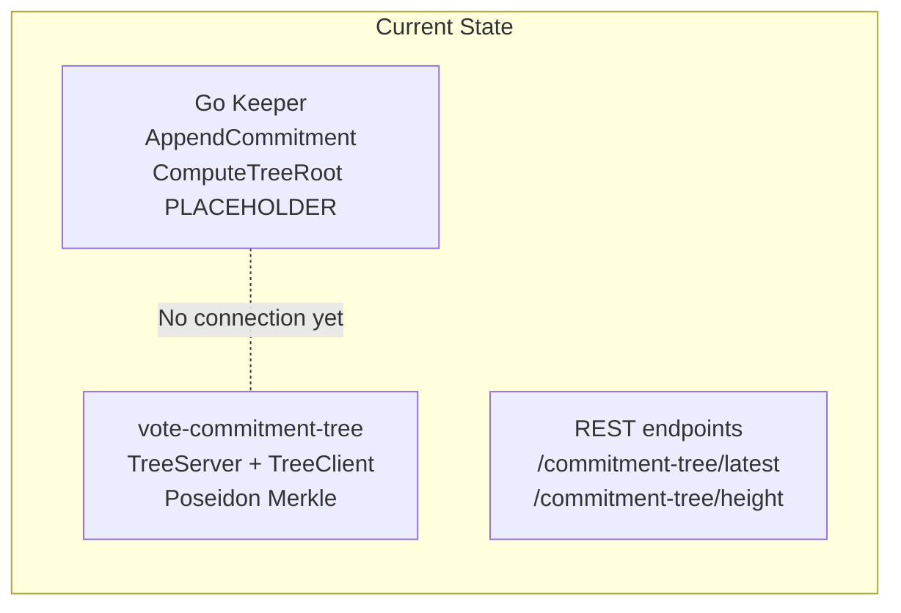
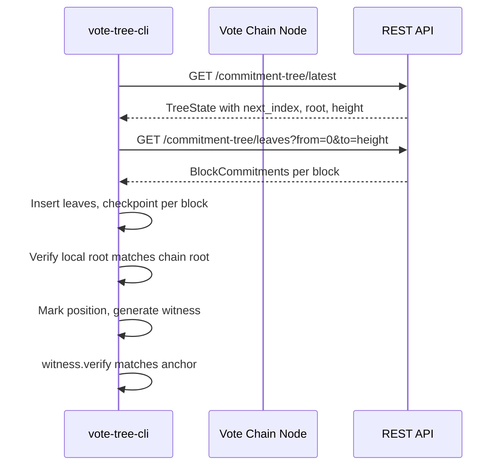
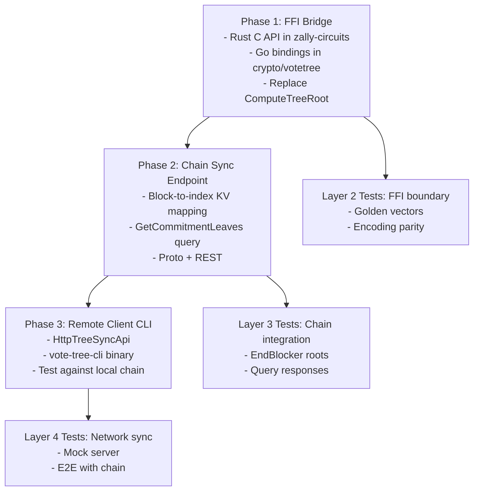

# Vote Commitment Tree SDK Integration Plan

## Current State

The vote-commitment-tree crate is a complete POC with `TreeServer`, `TreeClient`, `TreeSyncApi` trait, and 10 integration tests. The Go chain in `sdk/` stores leaves in KV, has query endpoints for tree state, and uses a **Blake2b placeholder** for `ComputeTreeRoot`. Existing FFI patterns in `[sdk/circuits/src/ffi.rs](sdk/circuits/src/ffi.rs)` and `[sdk/crypto/redpallas/verify_ffi.go](sdk/crypto/redpallas/verify_ffi.go)` provide the template for linking Rust from Go.




---

## Phase 1: FFI Bridge -- Replace Blake2b with Poseidon

**Goal:** The chain computes real Poseidon Merkle roots (and optionally paths) via Rust FFI, so on-chain roots match what circuits expect.

### Approach: Stateless FFI (matches current Go pattern)

The keeper already reads all leaves from KV in `ComputeTreeRoot`. We replace the Blake2b hash with a Rust FFI call that builds the tree and returns the root. This is the minimum viable change -- no state management, no handle lifecycle.

### Files to create/modify

**1. Add vote-commitment-tree as a dependency of zally-circuits**

In `[sdk/circuits/Cargo.toml](sdk/circuits/Cargo.toml)`, add:

```toml
vote-commitment-tree = { path = "../../vote-commitment-tree" }
```

This bundles tree computation into the existing `libzally_circuits.a` static library -- one Rust build, one Go link target, same pattern as RedPallas and Halo2.

**2. Add tree FFI functions to `[sdk/circuits/src/ffi.rs](sdk/circuits/src/ffi.rs)**`

Two new `extern "C"` functions following the existing convention:

- `zally_vote_tree_root(leaves_ptr, leaf_count, root_out) -> i32` -- Build tree from `leaf_count` leaves (each 32-byte LE Fp), write 32-byte root to `root_out`. Returns 0/success, -1/invalid input, -3/deserialization error.
- `zally_vote_tree_path(leaves_ptr, leaf_count, position, path_out) -> i32` -- Build tree, write 1028-byte auth path (4-byte position + 32x32-byte siblings) to `path_out`. Returns 0, -1, -2 (position out of range), -3.

Internally these construct a `TreeServer`, append all leaves, and call `root()` or `path()`.

**3. Update C header `[sdk/circuits/include/zally_circuits.h](sdk/circuits/include/zally_circuits.h)**`

Add function declarations for both new functions.

**4. Create Go bindings at `sdk/crypto/votetree/tree_ffi.go**`

New package `votetree` with build tag `//go:build votetree`, following the pattern in `[sdk/crypto/redpallas/verify_ffi.go](sdk/crypto/redpallas/verify_ffi.go)`:

- `ComputePoseidonRoot(leaves [][]byte) ([]byte, error)`
- `ComputeMerklePath(leaves [][]byte, position uint64) ([]byte, error)`

**5. Replace placeholder in `[sdk/x/vote/keeper/keeper.go](sdk/x/vote/keeper/keeper.go)**`

Update `ComputeTreeRoot` to call `votetree.ComputePoseidonRoot(leaves)` when the `votetree` build tag is set. Keep a stub fallback (Blake2b) without the tag, same pattern as halo2/redpallas.

### Why stateless first

- Matches the current Go pattern (read all leaves, compute root)
- No opaque-handle lifecycle management across Go GC boundaries
- Simple, correct, testable
- Optimization to stateful (in-memory tree handle, O(log n) per append) is a later phase -- the tree is small during governance rounds

---

## Phase 2: Chain Sync Endpoint -- Serve Leaves to Clients

**Goal:** Remote clients can sync the tree without parsing full Cosmos blocks.

### Missing endpoint

The chain serves tree **state** (`root`, `next_index`, `height`) but not **leaves**. The `TreeSyncApi` trait requires `get_block_commitments(from_height, to_height)` which returns leaves organized by block. The chain needs a new endpoint.

### Design

Add to `[sdk/x/vote/keeper/query_server.go](sdk/x/vote/keeper/query_server.go)`:

- `GetCommitmentLeaves(from_height, to_height)` -- returns `Vec<BlockCommitments>` where each entry has `height`, `start_index`, `leaves: Vec<[u8;32]>`.

This requires the keeper to track **which leaves belong to which block height**. Currently leaves are stored by index (`0x02 || index -> bytes`) but the block-to-index mapping is implicit. Two options:

- **Option A:** Add a new KV entry per block: `0x08 || height -> (start_index, count)`. The keeper writes this in the same tx that appends leaves. The query handler reads the mapping and fetches leaves by index range.
- **Option B:** Add leaves directly into the block-level metadata (e.g., events). The query handler reconstructs `BlockCommitments` from events. Less clean but avoids new KV entries.

**Recommend Option A** -- clean, queryable, matches `TreeSyncApi` semantics.

### Proto additions

In `[sdk/proto/zvote/v1/query.proto](sdk/proto/zvote/v1/query.proto)`:

```protobuf
message QueryCommitmentLeavesRequest {
  uint64 from_height = 1;
  uint64 to_height = 2;
}
message BlockCommitmentsProto {
  uint64 height = 1;
  uint64 start_index = 2;
  repeated bytes leaves = 3; // each 32 bytes
}
message QueryCommitmentLeavesResponse {
  repeated BlockCommitmentsProto blocks = 1;
}
```

### REST endpoint

`GET /zally/v1/commitment-tree/leaves?from_height=X&to_height=Y`

---

## Phase 3: Network TreeSyncApi + Remote Client CLI

**Goal:** A standalone Rust binary (not Zashi) that connects to a running vote chain, syncs the tree, and generates witnesses. This validates the full pipeline before Zashi integration.




### New crate: `vote-tree-remote-client`

```
vote-tree-remote-client/
  Cargo.toml         # depends on vote-commitment-tree, reqwest, serde, clap
  src/
    main.rs          # CLI: sync, witness, verify, status commands
    http_sync_api.rs # impl TreeSyncApi over HTTP (reqwest)
    types.rs         # JSON deserialization types for chain responses
```

`**HttpTreeSyncApi**` implements `TreeSyncApi` with:

- `get_tree_state()` -> `GET /zally/v1/commitment-tree/latest`
- `get_root_at_height(h)` -> `GET /zally/v1/commitment-tree/{h}`
- `get_block_commitments(from, to)` -> `GET /zally/v1/commitment-tree/leaves?from_height=X&to_height=Y`
- `Error = reqwest::Error`

**CLI commands** (via clap):

- `vote-tree-cli sync --node http://localhost:26657` -- sync to tip, print status
- `vote-tree-cli witness --position 42 --anchor-height 10` -- generate and print witness
- `vote-tree-cli verify --leaf <hex> --witness <hex> --root <hex>` -- verify a witness
- `vote-tree-cli status` -- print local tree state

### Testing against a local chain

Run a local vote chain node (docker or binary), submit MsgDelegateVote/MsgCastVote via the existing CLI or REST API, then use `vote-tree-cli sync` to verify the full pipeline. This is the "remote client" testing stage before Zashi.

---

## Phase 4: Integration Test Coverage

### Layer 1 -- Pure Rust (already covered, 10 tests)

Existing tests in `[vote-commitment-tree/tests/client_server_integration.rs](vote-commitment-tree/tests/client_server_integration.rs)` cover: full lifecycle, historical witnesses, sync API consistency, genesis sync, idempotency, path identity, two-client topology, shard boundaries, serialization, stress testing.

**No changes needed** -- this layer is solid.

### Layer 2 -- FFI Boundary (new tests)

These validate that the C API correctly bridges Rust and Go:

**a. Rust-side FFI tests** (in `sdk/circuits/src/ffi.rs` or `tests/`):

- `test_vote_tree_root_ffi_roundtrip` -- call `zally_vote_tree_root` via C ABI, compare with pure-Rust `TreeServer::root()`
- `test_vote_tree_path_ffi_roundtrip` -- call `zally_vote_tree_path`, deserialize, verify
- `test_ffi_empty_leaves` -- zero leaves returns empty tree root
- `test_ffi_null_pointers` -- returns -1
- `test_ffi_encoding_parity` -- verify `Fp::to_repr()` (32-byte LE) matches what Go stores

**b. Go-side FFI tests** (in `sdk/crypto/votetree/tree_ffi_test.go`):

- `TestComputePoseidonRoot` -- known leaves -> expected root
- `TestComputePoseidonRoot_MatchesRust` -- compare Go FFI result with a hardcoded root from the Rust tests
- `TestComputeMerklePath_Verifies` -- generate path, verify root derivation
- `TestComputePoseidonRoot_Empty` -- empty tree root
- `TestComputePoseidonRoot_SingleLeaf` -- single leaf

**c. Cross-validation golden test:**

- Hardcode a set of leaves and the expected root (computed by the pure-Rust `TreeServer`) as test vectors
- Both the Rust FFI test and Go test assert against the same golden values
- This catches encoding mismatches between the Go KV layer and Rust Fp representation

### Layer 3 -- Chain Integration (new tests)

These validate the Go keeper uses the FFI correctly:

- `TestEndBlockerPoseidonRoot` -- append leaves via keeper, run EndBlocker, verify stored root matches Rust golden value
- `TestCommitmentLeavesQuery` -- append leaves across blocks, query `GetCommitmentLeaves`, verify response shape and content
- `TestRootConsistencyAcrossBlocks` -- multiple blocks, roots at each height match incremental FFI computation
- `TestMsgDelegateVote_TreeGrowth` -- full message handler -> EndBlocker -> query root -> verify matches golden
- `TestMsgCastVote_TwoLeaves` -- append_two pattern: new VAN + VC, verify indices and root

### Layer 4 -- Network Sync (new tests)

These validate the HTTP TreeSyncApi:

**a. Mock server tests** (in `vote-tree-remote-client/tests/`):

- `test_http_sync_api_full_sync` -- start a mock HTTP server serving `TreeSyncApi` responses, create `HttpTreeSyncApi`, create `TreeClient`, sync, verify roots and witnesses
- `test_http_sync_api_incremental_sync` -- two rounds of sync, second round only fetches new blocks
- `test_http_sync_api_error_handling` -- server returns 500, verify graceful error propagation
- `test_http_sync_api_encoding` -- verify JSON/protobuf encoding of `BlockCommitments` matches chain format

**b. E2E tests** (require running chain):

- `test_e2e_delegate_sync_witness` -- submit MsgDelegateVote to local chain, CLI syncs, generates witness, verifies against chain root
- `test_e2e_cast_vote_sync_witness` -- full lifecycle through MsgCastVote
- `test_e2e_two_clients_sync` -- wallet client and helper server client sync independently, both produce valid witnesses

These E2E tests can be gated behind a feature flag or environment variable (`TEST_VOTE_CHAIN_URL`) so they only run against a live chain.

---

## Implementation Order




Phase 1 unblocks everything else. Phase 2 and FFI tests can proceed in parallel. Phase 3 depends on Phase 2 (needs the leaves endpoint). Layer 4 tests require all three phases.

---

## Key Design Decisions

- **Single library (zally-circuits)** rather than a separate vote-tree FFI crate -- follows existing pattern, one build, one link
- **Stateless FFI first** -- matches current Go pattern (read all leaves, compute root), simple, correct. Stateful optimization (in-memory handle, O(log n) per append) is a future optimization when tree size warrants it
- **Build tags** (`//go:build votetree`) -- same conditional compilation pattern as `redpallas` and `halo2`, so the chain can run without Rust for development
- **Golden test vectors** -- hardcoded leaf sets with expected roots, shared between Rust and Go tests, catch encoding mismatches early
- **Feature-gated E2E tests** -- network tests only run when `TEST_VOTE_CHAIN_URL` is set, keeping `cargo test` fast for local development

