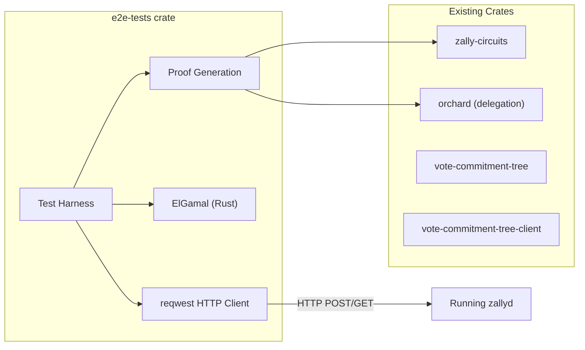

# Rust E2E API Test Suite

## Motivation

The current TypeScript API tests depend on pre-generated fixtures with expiring `vote_end_time` timestamps, creating fragile CI and a poor local dev loop. A Rust test crate can generate proofs, signatures, and ElGamal ciphertexts inline, eliminating fixtures entirely.

## Architecture

## New Crate: `e2e-tests/`

Create a standalone crate at the repo root (not inside `sdk/` since it's a Go module). This is a test-only crate with no library — just integration tests.

**Path:** `e2e-tests/Cargo.toml`

**Key dependencies:**

- `zally-circuits` (path dep) — delegation proof generation, RedPallas
- `orchard` (path dep, `delegation` feature) — `build_delegation_bundle`, circuit types
- `vote-commitment-tree` (path dep) — Merkle tree verification
- `reqwest = { version = "0.12", features = ["blocking", "json"] }` — HTTP client (blocking, matching `vote-commitment-tree-client`)
- `serde`, `serde_json` — JSON serialization
- `base64`, `hex` — encoding
- `blake2b_simd` — `vote_round_id` derivation
- `pasta_curves`, `ff`, `group` — field arithmetic for ElGamal
- `rand`, `rand_core` — randomness

## Key Components

### 1. ElGamal in Rust (`e2e-tests/src/elgamal.rs`)

Port the Go ElGamal from [sdk/crypto/elgamal/elgamal.go](sdk/crypto/elgamal/elgamal.go) to Rust using `pasta_curves::pallas`. This is ~60 lines of core logic:

- `keygen(rng) -> (SecretKey, PublicKey)` — `sk * G`
- `encrypt(pk, value, rng) -> Ciphertext` — `(r*G, v*G + r*pk)`
- `homomorphic_add(a, b) -> Ciphertext` — pointwise addition
- `marshal/unmarshal` — 64 bytes (two 32-byte compressed Pallas points)

The Go implementation uses the `curvey` library (Pallas curve). The Rust port uses `pasta_curves::pallas::{Point, Scalar}` directly — same curve, just a different library. The serialization must produce identical bytes (compressed affine, 32 bytes per point) so the chain's Go `HomomorphicAdd` and the Rust-generated ciphertexts are compatible.

### 2. API Client Module (`e2e-tests/src/api.rs`)

Thin wrapper around `reqwest::blocking::Client`:

- `post_json(path, body) -> (status, serde_json::Value)` — with retry on socket errors
- `get_json(path) -> (status, serde_json::Value)` — with retry
- `wait_for_round_status(round_id_hex, expected, timeout)` — polling loop
- `BASE_URL` from env `ZALLY_API_URL` or default `http://localhost:1317`

### 3. Payload Builders (`e2e-tests/src/payloads.rs`)

Construct JSON payloads matching the chain's REST API (snake_case, base64-encoded bytes):

- `create_voting_session(ea_pk, opts)` — returns `(body, round_id)`
- `delegate_vote(round_id, bundle)` — takes a `DelegationBundle` directly, no fixtures
- `cast_vote(round_id, anchor_height)` — mock proof, unique nullifiers
- `reveal_share(round_id, anchor_height, enc_share, proposal_id, vote_decision)` — takes real ElGamal ciphertext
- `submit_tally(round_id, creator, entries)`

`vote_round_id` derivation: `Blake2b-256(snapshot_height_be || snapshot_blockhash || proposals_hash || vote_end_time_be || nullifier_imt_root || nc_root)` — same as [sdk/x/vote/keeper/msg_server.go](sdk/x/vote/keeper/msg_server.go).

### 4. Main Test (`e2e-tests/tests/voting_flow.rs`)

Single `#[test]` function (or a few grouped with a shared setup) that runs the full lifecycle. Blocking reqwest keeps it simple — no async runtime needed.

**Setup phase (runs once, ~30-60s for proof gen):**

1. Generate ElGamal keypair `(sk, pk)` using deterministic seed
2. Pick session params: `snapshot_height`, `snapshot_blockhash`, `proposals_hash`, `vote_end_time = now + 120s`, tree roots
3. Build real delegation bundle via `build_delegation_bundle()` — generates ZKP #1 proof + RedPallas signature
4. Create session on chain with the generated `ea_pk`
5. Derive `round_id` locally

**Active phase tests (steps 1-8):**

- Same 21 steps as TypeScript, but delegation uses the just-generated proof
- Cast vote and reveal share use mock proofs (chain accepts any bytes without `-tags halo2`)
- Reveal shares use `encrypt(pk, value, rng)` directly — no fixture file

**Tallying phase (steps 9-21):**

- `vote_end_time` is only 120s away (set during setup), so the wait is short
- `expected_accumulated = homomorphic_add(share_0, share_1)` computed locally
- Submit tally with the known `expected_total`

### 5. Makefile Integration

Update [Makefile](Makefile) and [sdk/Makefile](sdk/Makefile):

- `make test-e2e` — runs `cargo test --release --manifest-path e2e-tests/Cargo.toml -- --nocapture`
- Keep `make test-api` as alias for backward compat (points to `test-e2e`)

### 6. CI Update ([.github/workflows/ci.yml](.github/workflows/ci.yml))

Replace the `test-api` job's npm steps with a single cargo test:

- Remove: Node.js setup, `npm ci`, `make fixtures`, npm test
- Add: `cargo test --release --manifest-path e2e-tests/Cargo.toml -- --nocapture --test-threads=1`
- Keep: Rust setup, cache, chain init/start/wait (unchanged)

### 7. Cleanup

After the Rust tests pass and cover the same steps:

- Delete `sdk/tests/api/` (TypeScript tests, vitest config, fixtures, package.json)
- Delete `sdk/circuits/tests/generate_fixtures.rs` — no longer needed (delegation fixture generation is now inline in the test)
- Keep `sdk/crypto/elgamal/gen_fixtures_test.go` — still useful for Go unit tests of ElGamal

## What stays the same

- The chain binary (`zallyd`), REST API handlers, protobuf definitions — untouched
- `vote-commitment-tree-client` CLI — the Rust E2E tests can shell out to it the same way TypeScript did, or call the library directly
- `make init`, `make start` workflow — unchanged
- Go unit and integration tests — unchanged

## Risk: K=14 proof generation time

`build_delegation_bundle` + `create_delegation_proof` at K=14 takes 30-120s. This runs once per test suite invocation. Mitigation:

- Use `--release` (already standard for Halo2)
- Cache proving keys on disk (Halo2 `ParamsKZG` / IPA params are deterministic)
- The test is inherently serial (chain state), so parallelism doesn't help anyway
- Total test time: ~3 min (proof gen + chain interaction + TALLYING wait) — comparable to current TypeScript flow

## File inventory

- `e2e-tests/Cargo.toml` — new crate
- `e2e-tests/src/lib.rs` — module declarations
- `e2e-tests/src/elgamal.rs` — Pallas ElGamal (keygen, encrypt, homomorphic_add, marshal)
- `e2e-tests/src/api.rs` — HTTP client wrapper
- `e2e-tests/src/payloads.rs` — JSON payload builders + round_id derivation
- `e2e-tests/tests/voting_flow.rs` — the 21-step E2E test
- `.github/workflows/ci.yml` — updated test-api job
- `Makefile`, `sdk/Makefile` — new `test-e2e` target

