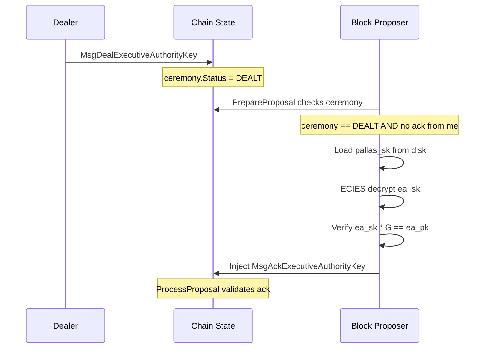

# Auto-Ack via PrepareProposal for Ceremony Phase D

## Context

The ceremony currently requires each validator to manually submit `MsgAckExecutiveAuthorityKey` after the dealer posts `MsgDealExecutiveAuthorityKey`. The design doc (Phase D) explicitly calls out automating this via `PrepareProposal`/`ProcessProposal`.

The codebase already has a working pattern for this: `[sdk/app/prepare_proposal.go](sdk/app/prepare_proposal.go)` auto-injects `MsgSubmitTally` when a round enters TALLYING state, and `[sdk/x/vote/keeper/keeper.go:497-504](sdk/x/vote/keeper/keeper.go)` blocks that message from the mempool. We replicate this pattern for ack injection.

## Design

### Flow

With round-robin proposer selection and `n` validators, all acks complete within ~`n` blocks after the DealerTx lands.

### Key decisions

- **New config**: `vote.pallas_sk_path` in `app.toml` (alongside existing `vote.ea_sk_path`). Validators point this to their Pallas secret key file. Without it, ack injection is skipped gracefully.
- **PrepareProposal**: Extend the existing handler (or compose a second handler) to check if ceremony is DEALT, the proposer hasn't acked yet, and they have a Pallas SK on disk. If so, decrypt their ECIES payload, verify `ea_sk * G == ea_pk`, and prepend `MsgAckExecutiveAuthorityKey`.
- **ProcessProposal**: Add a custom `ProcessProposal` handler that validates injected ack txs. For ack messages: verify the creator is a registered validator, the ceremony is DEALT, and no duplicate ack exists. For tally messages: reuse existing proposer validation. All other txs pass through.
- **Mempool blocking**: Add `ValidateAckSubmitter` in the keeper (mirroring `ValidateTallySubmitter`) to reject `MsgAckExecutiveAuthorityKey` during CheckTx/ReCheckTx. This ensures acks can only arrive via PrepareProposal.
- **EA key persistence**: After successful decryption and verification, write `ea_sk` to the `vote.ea_sk_path` file. This primes the auto-tally system for later rounds without manual intervention. Log it prominently.
- **Ack signature**: The current `AckEntry` has an `ack_signature` field. For auto-ack, compute the signature as `SHA256("ack" || ea_pk || validator_address)` (matching the design doc).
- **CLI keygen**: Add a `pallas-keygen` command (mirroring `ea-keygen`) that generates and writes `pallas.sk` / `pallas.pk` to the node home directory.

## Files to change

### New files

- `[sdk/app/prepare_proposal_ceremony.go](sdk/app/prepare_proposal_ceremony.go)` -- Ceremony ack injection logic for PrepareProposal (separated from tally logic for clarity)
- `[sdk/app/process_proposal.go](sdk/app/process_proposal.go)` -- ProcessProposal handler validating injected ceremony acks and tally txs
- `[sdk/cmd/zallyd/cmd/pallas_keygen.go](sdk/cmd/zallyd/cmd/pallas_keygen.go)` -- CLI command to generate Pallas keypair

### Modified files

- `[sdk/app/prepare_proposal.go](sdk/app/prepare_proposal.go)` -- Compose ceremony ack injection into the PrepareProposal handler alongside existing tally injection
- `[sdk/app/app.go](sdk/app/app.go)` -- Wire `vote.pallas_sk_path` config, install `ProcessProposal` handler
- `[sdk/x/vote/keeper/keeper.go](sdk/x/vote/keeper/keeper.go)` -- Add `ValidateAckSubmitter()` (mempool blocking for ack, mirror of `ValidateTallySubmitter`)
- `[sdk/x/vote/keeper/msg_server_ceremony.go](sdk/x/vote/keeper/msg_server_ceremony.go)` -- Call `ValidateAckSubmitter` at the top of `AckExecutiveAuthorityKey`
- `[sdk/scripts/init.sh](sdk/scripts/init.sh)` -- Generate Pallas keypair, add `pallas_sk_path` to app.toml
- `[sdk/cmd/zallyd/cmd/commands.go](sdk/cmd/zallyd/cmd/commands.go)` -- Register `PallasKeygenCmd`

### Test files

- `[sdk/app/abci_test.go](sdk/app/abci_test.go)` -- Add `TestPrepareProposalAutoAck` (mirrors `TestPrepareProposalAutoTally`)
- `[sdk/x/vote/keeper/keeper_ceremony_test.go](sdk/x/vote/keeper/keeper_ceremony_test.go)` -- Test mempool blocking for ack

## Implementation notes

- The Pallas SK is loaded once via `sync.Once` (same pattern as EA SK in `[prepare_proposal.go:48-76](sdk/app/prepare_proposal.go)`).
- If decryption fails or verification fails (`ea_sk * G != ea_pk`), log a loud error and skip injection -- do not crash the node. This matches the design doc's note about validators not acking if they receive garbage.
- The `DefaultDealTimeout` is 30 seconds. With auto-ack, all validators should ack within ~`n` blocks (seconds), well within the timeout.
- After writing `ea_sk` to disk, the tally auto-injection (which loads via `sync.Once`) will pick it up on next node restart. For the current session, the key is already in memory from the decryption step, but the file write ensures persistence.

