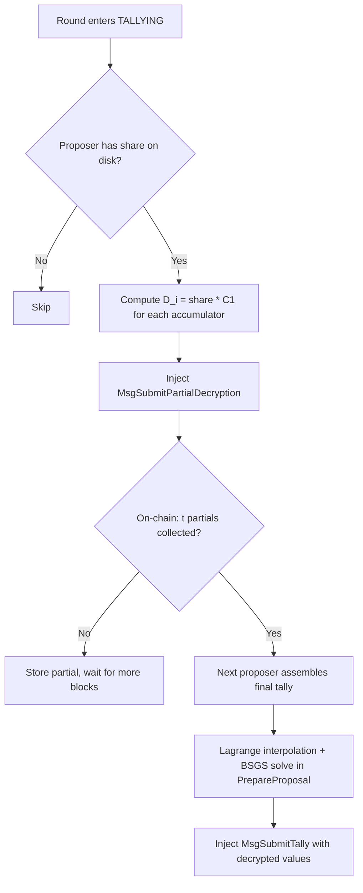

# Threshold Decryption for the EA Key Ceremony

## Goal

Prevent any single non-dealer party from decrypting individual votes. Only the aggregate tally should be recoverable, and only with cooperation of at least t = n/3 + 1 validators.

The design is delivered in four incremental steps. Step 1 achieves the main **privacy** improvement (only the dealer knows `ea_sk`, down from every validator). Steps 2–3 add **correctness** guarantees against misbehaving participants. Step 4 eliminates the dealer entirely.

| Step | What's added | Privacy (who can decrypt) | Correctness (who can sabotage) |
| ---- | ------------ | ------------------------- | ------------------------------ |
| Current | — | Any single validator | N/A (no threshold) |
| 1. TSS | Shamir + partial decrypt + Lagrange | Dealer only | Dealer or any validator |
| 2. DLEQ | Dealer-published VK_i + DLEQ proofs | Dealer only | Dealer only |
| 3. Feldman | Polynomial commitments replace VK_i | Dealer only | Nobody |
| 4. DKG | Pedersen DKG replaces dealer | Nobody | Nobody |

---

## Step 1: Threshold Secret Sharing (Privacy)

The dealer still generates `ea_sk`, but distributes **(t, n) Shamir shares** instead of the full key. No single non-dealer validator can decrypt. No verification of partial decryptions — correctness relies on honest participants.

**Trust model:** trust dealer + trust validators.

### 1.1 New Crypto Primitives

Create `sdk/crypto/shamir/` package:

- **`shamir.go`** — Shamir secret sharing over Pallas Fq
  - `Split(secret Scalar, t, n int) -> []Share` — evaluate random degree-(t-1) polynomial at points 1..n
  - `LagrangeCoefficients(indices []int, target int) -> []Scalar` — compute Lagrange basis at a target point (0 for reconstruction)
  - `Reconstruct(shares []Share, t int) -> Scalar` — recover the secret (used only in tests to verify correctness)
- **`partial_decrypt.go`** — Threshold ElGamal decryption
  - `PartialDecrypt(share Scalar, C1 Point) -> Point` — compute `D_i = share * C1`
  - `CombinePartials(partials []Point, indices []int) -> Point` — Lagrange interpolation in the exponent: `sum(lambda_i * D_i)`

### 1.2 Ceremony Changes

**Deal phase** — modify [sdk/app/prepare_proposal_ceremony.go](sdk/app/prepare_proposal_ceremony.go):

```
Current:  generate ea_sk → ECIES(ea_sk, pk_i) for each validator
New:      generate ea_sk → polynomial f(x) with f(0)=ea_sk
          → ECIES(f(i), pk_i) for each validator
          → publish VK_i = f(i) * G for each validator
```

- `MsgDealExecutiveAuthorityKey` gains `repeated bytes verification_keys` (one 32-byte compressed Pallas point per validator)
- The dealer writes their own share `f(dealer_index)` to disk (not `ea_sk`)

**Ack phase** — modify [sdk/x/vote/keeper/msg_server_ceremony.go](sdk/x/vote/keeper/msg_server_ceremony.go):

```
Current:  decrypt ECIES → get ea_sk → verify ea_sk * G == ea_pk → ack
New:      decrypt ECIES → get share_i → verify share_i * G == VK_i → ack
```

- Each validator verifies their share against the dealer-published `VK_i`
- Each validator writes `share_i` to disk (replaces `ea_sk` file)

**On-chain state** — modify `VoteRound` protobuf:

- Add `repeated bytes verification_keys` field (n points, one per validator)
- Add `uint32 threshold` field (t value, defaults to `ceil(n/3) + 1` if 0)

### 1.3 Tally Changes

This is the biggest structural change. Currently one proposer decrypts everything. Now:

**New message: `MsgSubmitPartialDecryption`**

```protobuf
message MsgSubmitPartialDecryption {
  bytes  vote_round_id    = 1;
  string creator          = 2;  // validator operator address
  uint32 validator_index  = 3;  // index in ceremony_validators (1-based, matches Shamir eval point)
  repeated PartialDecryptionEntry entries = 4;
}

message PartialDecryptionEntry {
  uint32 proposal_id     = 1;
  uint32 vote_decision   = 2;
  bytes  partial_decrypt  = 3;  // 32 bytes: D_i = share_i * C1
}
```

Note: no `dleq_proof` field yet — added in Step 2.

**PrepareProposal flow** (new injector, replaces current tally injector):



**On-chain partial decryption storage** (new KV prefix):

- Key: `0x10 || round_id || validator_index` -> `PartialDecryptionEntry[]` protobuf
- In Step 1, partials are accepted without proof (no DLEQ verification)

**MsgSubmitTally changes:**

- Currently: proposer decrypts locally, submits plaintext + DLEQ proof per accumulator
- New: proposer reads t partial decryptions from KV, performs Lagrange interpolation in the exponent locally, runs BSGS, submits plaintext values
- Verification: on-chain recombines the stored partials using Lagrange interpolation, checks `C2 - combined_partial == totalValue * G`

### 1.4 File Change Summary

| File | Change |
| ---- | ------ |
| `sdk/crypto/shamir/` (new) | Shamir splitting, partial decryption, Lagrange interpolation |
| `sdk/proto/zvote/v1/tx.proto` | Add `MsgSubmitPartialDecryption`, add `verification_keys` + `threshold` to deal msg |
| `sdk/app/prepare_proposal_ceremony.go` | Deal: polynomial split + VK_i instead of raw ea_sk |
| `sdk/app/prepare_proposal.go` | Tally: partial decryption injection + final tally assembly |
| `sdk/x/vote/keeper/msg_server_ceremony.go` | Ack: verify share against dealer-published VK_i |
| `sdk/x/vote/keeper/msg_server.go` | New handler for `MsgSubmitPartialDecryption`, modified `SubmitTally` verification |
| `sdk/x/vote/keeper/keeper.go` | KV accessors for partial decryption and VK_i storage |
| `sdk/x/vote/types/keys.go` | New KV prefix for partial decryptions |

### 1.5 What Step 1 Does NOT Solve

- **Dealer sabotage:** A malicious dealer can send inconsistent shares. The tally would fail at combination time with no way to identify the cause. (Fixed in Step 3.)
- **Validator sabotage:** A malicious validator can submit a fake partial decryption. The chain accepts it without proof, and the tally produces wrong results. (Fixed in Step 2.)
- **Dealer privacy:** The dealer still generates `ea_sk` in memory. A malicious dealer who saves it can decrypt individual votes. (Fixed in Step 4.)

---

## Step 2: DLEQ Proofs (Correctness vs. Validators)

Add DLEQ proofs to partial decryptions so the chain can reject fake partials at submission time. The dealer-published `VK_i` from Step 1 provides the reference point for verification.

**Trust model:** trust dealer only. Validators cannot sabotage the tally.

### 2.1 Changes

**`PartialDecryptionEntry`** gains a `dleq_proof` field:

```protobuf
message PartialDecryptionEntry {
  uint32 proposal_id     = 1;
  uint32 vote_decision   = 2;
  bytes  partial_decrypt  = 3;  // 32 bytes: D_i = share_i * C1
  bytes  dleq_proof       = 4;  // proves log_G(VK_i) == log_{C1}(D_i)
}
```

**PrepareProposal** (partial decryption injector): after computing `D_i`, generate a DLEQ proof for each entry. Reuse existing [sdk/crypto/elgamal/dleq.go](sdk/crypto/elgamal/dleq.go) pattern.

**On-chain `MsgSubmitPartialDecryption` handler**: verify each DLEQ proof against `VK_i` (read from KV) before storing. Reject the message if any proof fails.

### 2.2 Why This Works

DLEQ proves `log_G(VK_i) == log_{C1}(D_i)` — the validator used the same scalar for both their verification key and their partial decryption. Since `VK_i` is pinned by the dealer (not self-asserted), a malicious validator cannot forge a valid proof with a fake share. The chain rejects bad partials immediately, before they can pollute the Lagrange combination.

### 2.3 File Changes

| File | Change |
| ---- | ------ |
| `sdk/crypto/shamir/partial_decrypt.go` | Add DLEQ proof generation (`PartialDecryptWithProof`) |
| `sdk/proto/zvote/v1/tx.proto` | Add `dleq_proof` field to `PartialDecryptionEntry` |
| `sdk/app/prepare_proposal.go` | Generate DLEQ proof alongside each partial decryption |
| `sdk/x/vote/keeper/msg_server.go` | Verify DLEQ proof in `MsgSubmitPartialDecryption` handler |

---

## Step 3: Feldman Commitments (Correctness vs. Dealer)

Replace the per-validator `VK_i` list with **Feldman polynomial commitments**. The dealer publishes `t` coefficient commitments from which all `n` verification keys are derivable. This lets validators (and the chain) verify that shares are consistent evaluations of a single polynomial — catching a malicious dealer at ack time.

**Trust model:** trust nobody for correctness. (Dealer still knows `ea_sk` for privacy.)

### 3.1 New Crypto

Add to `sdk/crypto/shamir/`:

- **`feldman.go`** — Feldman verifiable commitments
  - `FeldmanCommit(coefficients []Scalar) -> []Point` — publish `[a_0*G, a_1*G, ..., a_{t-1}*G]`
  - `FeldmanVerify(commitments []Point, index int, share Scalar) -> bool` — check `share * G == sum(C_j * index^j)`
  - `DeriveVerificationKey(commitments []Point, index int) -> Point` — compute `VK_i = sum(C_j * i^j)`

### 3.2 Changes

**Deal phase**: replace `verification_keys` (n points) with `feldman_commitments` (t points). More compact and provides polynomial consistency.

```
Step 1:   publish VK_i = f(i) * G for each validator (n points)
Step 3:   publish [a_0*G, ..., a_{t-1}*G] (t points, VK_i derivable)
```

**Ack phase**: verify `share_i * G == sum(C_j * i^j)` instead of just checking against a single dealer-asserted point. This proves the share is a valid evaluation of the committed polynomial.

**On-chain state**: `VoteRound` replaces `repeated bytes verification_keys` with `repeated bytes feldman_commitments`. `VK_i` is derived on-the-fly when needed for DLEQ verification.

**Bonus**: `ea_pk` is now derivable as `feldman_commitments[0]` (the constant term `a_0 * G = ea_sk * G`).

### 3.3 File Changes

| File | Change |
| ---- | ------ |
| `sdk/crypto/shamir/feldman.go` (new) | Feldman commit, verify, derive VK_i |
| `sdk/proto/zvote/v1/tx.proto` | Replace `verification_keys` with `feldman_commitments` in deal msg + VoteRound |
| `sdk/app/prepare_proposal_ceremony.go` | Deal: publish Feldman commitments instead of explicit VK_i |
| `sdk/x/vote/keeper/msg_server_ceremony.go` | Ack: verify share against Feldman commitments |
| `sdk/x/vote/keeper/msg_server.go` | Derive VK_i from commitments for DLEQ verification |

---

## Step 4: Pedersen DKG (Privacy — Eliminates Dealer)

Upgrade the ceremony so that **no single party ever knows `ea_sk`**. The tally pipeline from Steps 1–3 is reused unchanged.

**Trust model:** trust nobody.

### 4.1 Ceremony State Machine Change

```
Steps 1-3: REGISTERING --> DEALT --> CONFIRMED
Step 4:    REGISTERING --> COMMITTING --> SHARING --> CONFIRMED
```

- **COMMITTING**: Each validator generates their own degree-(t-1) polynomial `f_i(x)`, publishes Feldman commitments `[a_{i,0}*G, ..., a_{i,t-1}*G]` via a new `MsgCommitPolynomial`
- **SHARING**: Each validator distributes `ECIES(f_i(j), pk_j)` to all others via `MsgDistributeShares`. Each recipient verifies against committed Feldman values and acks.
- **CONFIRMED**: Each validator computes `sk_share_i = sum_j(f_j(i))`. The combined public key is `ea_pk = sum_j(C_{j,0})`.

### 4.2 What Changes from Steps 1–3

- Ceremony gains one additional round (COMMITTING before SHARING)
- `MsgDealExecutiveAuthorityKey` is replaced by `MsgCommitPolynomial` + `MsgDistributeShares`
- The dealer role disappears — all validators are equal contributors
- **Tally pipeline is identical** — partial decryptions, DLEQ proofs, Lagrange interpolation, BSGS, same verification

### 4.3 New Crypto Required

None — all primitives (Shamir, Feldman, partial decryption, Lagrange, DLEQ) are built in Steps 1–3. The only new work is the ceremony state machine and message handlers.

---

## Security Properties Summary

| Property | Current | Step 1 (TSS) | Step 2 (+DLEQ) | Step 3 (+Feldman) | Step 4 (DKG) |
| -------- | ------- | ------------ | --------------- | ----------------- | ------------ |
| Dealer knows ea_sk | Yes (every validator does) | Yes (dealer only) | Yes (dealer only) | Yes (dealer only) | No dealer exists |
| Single non-dealer can decrypt | Yes | No | No | No | No |
| Malicious validator can sabotage tally | N/A | Yes | No | No | No |
| Malicious dealer can sabotage shares | N/A | Yes | Yes | No | No dealer exists |
| Threshold for tally | 1 (any validator) | t = n/3 + 1 | t = n/3 + 1 | t = n/3 + 1 | t = n/3 + 1 |
| Liveness for tally | 1 validator | t validators | t validators | t validators | t validators |


