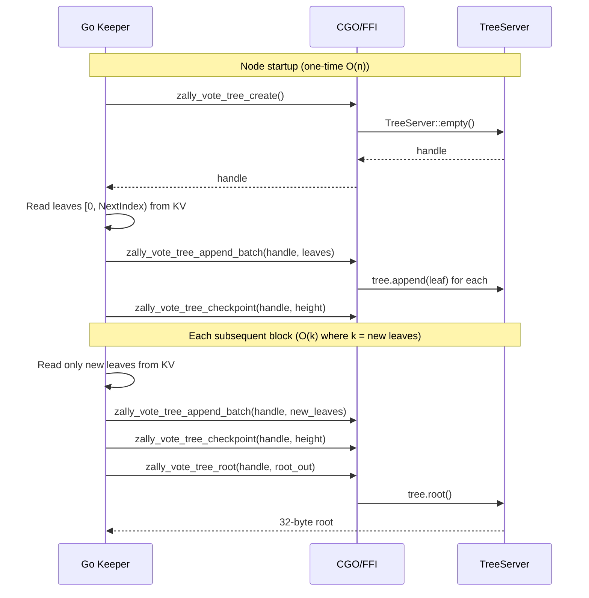

# Incremental Vote Commitment Tree on the SDK Side

## Problem

Every EndBlocker call in `[sdk/x/vote/keeper/tree_root_poseidon.go](sdk/x/vote/keeper/tree_root_poseidon.go)` reads **all** leaves from KV, passes them across FFI, and rebuilds the entire Merkle tree from scratch:

```go
leaves := make([][]byte, nextIndex)
for i := uint64(0); i < nextIndex; i++ {
    leaf, err := kvStore.Get(types.CommitmentLeafKey(i))
    ...
}
return votetree.ComputePoseidonRoot(leaves)
```

This is O(n) per block. With depth-24 capacity (16.7M leaves), this becomes a bottleneck as the tree grows.

## Approach: Stateful Rust tree handle behind FFI

`TreeServer` (wrapping ShardTree) already supports incremental appends and efficient root computation. The current FFI is stateless -- it creates a fresh tree per call. The fix is to hold a `TreeServer` instance alive on the Rust side and expose lifecycle operations through CGO.




KV remains the source of truth. The Rust tree is derived state (a cache). On mismatch (crash recovery, rollback), the Go side detects `tree.size() != NextIndex` and rebuilds.

## Layer 1: Rust stateful API

**File: `[sdk/circuits/src/votetree.rs](sdk/circuits/src/votetree.rs)**`

Add alongside existing stateless functions (keep those for backward compat):

```rust
pub struct TreeHandle {
    tree: TreeServer,
}

impl TreeHandle {
    pub fn new() -> Box<TreeHandle> { ... }
    pub fn append(&mut self, leaf: Fp) -> u64 { ... }
    pub fn append_batch(&mut self, leaves: &[Fp]) { ... }
    pub fn checkpoint(&mut self, height: u32) { ... }
    pub fn root(&self) -> [u8; 32] { ... }
    pub fn root_at_height(&self, height: u32) -> Option<[u8; 32]> { ... }
    pub fn size(&self) -> u64 { ... }
    pub fn path(&self, position: u64, height: u32) -> Option<Vec<u8>> { ... }
}
```

## Layer 2: C FFI wrappers

**File: `[sdk/circuits/src/ffi.rs](sdk/circuits/src/ffi.rs)**`

New `extern "C"` functions using opaque `*mut TreeHandle`:

- `zally_vote_tree_create() -> *mut TreeHandle`
- `zally_vote_tree_append_batch(handle, leaves_ptr, leaf_count) -> i32`
- `zally_vote_tree_checkpoint(handle, height) -> i32`
- `zally_vote_tree_root_stateful(handle, root_out) -> i32`
- `zally_vote_tree_size(handle) -> u64`
- `zally_vote_tree_path_stateful(handle, position, height, path_out) -> i32`
- `zally_vote_tree_free(handle)`

**File: `[sdk/circuits/include/zally_circuits.h](sdk/circuits/include/zally_circuits.h)**`

Add C declarations for the above.

## Layer 3: Go CGO bindings

**File: `[sdk/crypto/votetree/tree_ffi.go](sdk/crypto/votetree/tree_ffi.go)**`

Add Go wrappers:

```go
type TreeHandle struct {
    ptr unsafe.Pointer  // *C.TreeHandle (opaque)
}

func NewTreeHandle() *TreeHandle { ... }
func (h *TreeHandle) AppendBatch(leaves [][]byte) error { ... }
func (h *TreeHandle) Checkpoint(height uint32) error { ... }
func (h *TreeHandle) Root() ([]byte, error) { ... }
func (h *TreeHandle) Size() uint64 { ... }
func (h *TreeHandle) Path(position uint64, height uint32) ([]byte, error) { ... }
func (h *TreeHandle) Close() { ... }  // calls zally_vote_tree_free
```

## Layer 4: Keeper integration

**File: `[sdk/x/vote/keeper/keeper.go](sdk/x/vote/keeper/keeper.go)**`

Add `treeHandle *votetree.TreeHandle` field to `Keeper`:

```go
type Keeper struct {
    storeService store.KVStoreService
    authority    string
    logger       log.Logger
    treeHandle   *votetree.TreeHandle  // stateful Rust tree (lazy-initialized)
    treeCursor   uint64                // leaves appended to treeHandle so far
}
```

Add `ensureTreeLoaded(kvStore, nextIndex)` method:

- If `treeHandle == nil`: create handle, load all leaves from KV, append, checkpoint -- one-time O(n) on startup
- If `treeCursor == nextIndex`: no-op (tree is up to date)
- If `treeCursor < nextIndex`: append only leaves `[treeCursor, nextIndex)` from KV -- O(k) per block
- If `treeCursor > nextIndex`: state rollback detected -- recreate handle and rebuild

**File: `[sdk/x/vote/keeper/tree_root_poseidon.go](sdk/x/vote/keeper/tree_root_poseidon.go)**`

Replace `ComputeTreeRoot`:

```go
func (k *Keeper) ComputeTreeRoot(kvStore store.KVStore, nextIndex uint64) ([]byte, error) {
    if nextIndex == 0 {
        return nil, nil
    }
    if err := k.ensureTreeLoaded(kvStore, nextIndex); err != nil {
        return nil, err
    }
    return k.treeHandle.Root()
}
```

Note: `Keeper` receiver changes from value to pointer (`*Keeper`) since it now mutates `treeHandle` and `treeCursor`. This requires updating `NewKeeper` to return `*Keeper` and all method receivers.

## Layer 5: EndBlocker checkpoint

**File: `[sdk/x/vote/module.go](sdk/x/vote/module.go)**`

After computing the root in `EndBlock`, also call checkpoint on the tree handle so that `root_at_height` queries work for the stateful tree:

```go
if err := am.keeper.CheckpointTree(uint32(blockHeight)); err != nil {
    return err
}
```

## What stays unchanged

- The **stateless** `ComputePoseidonRoot` / `ComputeMerklePath` Go functions remain for tests and backward compat
- The **KV store layout** is unchanged -- leaves, roots, block-leaf-index all stay the same
- The **TreeClient** (sparse client tree) is unaffected
- The **REST API** for sync is unaffected

## Complexity per block


| Operation                   | Before                                | After                                                    |
| --------------------------- | ------------------------------------- | -------------------------------------------------------- |
| EndBlocker root computation | O(n) -- read all leaves, rebuild tree | O(k) -- read k new leaves, append to tree                |
| Node startup (one-time)     | N/A                                   | O(n) -- rebuild tree from KV (lazy, on first EndBlocker) |
| Witness generation          | O(n) -- same rebuild pattern          | O(1) if tree loaded, O(n) on cold start                  |


