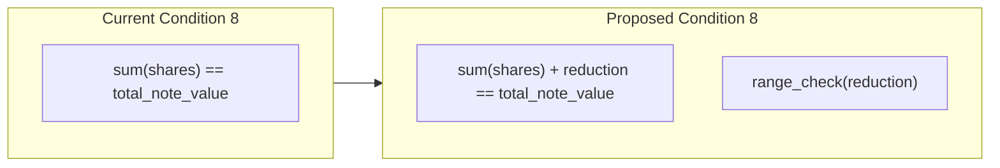

# Voluntary Weight Reduction (Private)

## Problem

In a weighted voting system with public tallies, the aggregate total for each (proposal, decision) pair is published. When few voters choose a particular option, the aggregate reveals individual voter weights. In the extreme case — a single voter for an option — the tally IS their exact weight.

This is not a cryptographic break (voter identity remains unlinkable via the ZKP architecture), but the weight itself can be a deanonymization vector: if an adversary can estimate a voter's ZEC balance through external means, matching that balance to a tally output narrows the anonymity set.

No share-splitting strategy (even, random, or segmented) can address this because the tally sums all shares regardless of decomposition. The information leaks through the aggregate output, not through individual share values.

## Solution

Add a private `reduction` witness to ZKP #2's condition 8. The voter chooses how much weight to forfeit for a single vote. The reduction is never revealed — it remains a private witness in the circuit. The voter's VAN retains full weight for future votes.



When `reduction = 0`, behavior is identical to today (full weight). The verification key changes but public inputs do not.

## Circuit change (ZKP #2 only)

**File**: [voting-circuits/src/vote_proof/circuit.rs](voting-circuits/src/vote_proof/circuit.rs)

### New witness field

Add to the `Circuit` struct (line ~446):

```rust
pub(crate) reduction: Value<pallas::Base>,
```

Initialize to `Value::known(pallas::Base::zero())` in `with_van_witnesses` for backward-compatible default behavior.

### Modified condition 8 (lines 1044-1064)

Replace the current equality constraint:

```rust
// Current: shares_sum == total_note_value
region.constrain_equal(shares_sum.cell(), total_note_value_cond8.cell())
```

With:

```rust
// New: shares_sum + reduction == total_note_value
let reduction_cell = assign_free_advice(
    layouter.namespace(|| "witness reduction"),
    config.advices[0],
    self.reduction,
)?;
let effective_plus_reduction = config.add_chip().add(
    layouter.namespace(|| "shares_sum + reduction"),
    &shares_sum,
    &reduction_cell,
)?;
layouter.assign_region(
    || "shares_sum + reduction == total_note_value",
    |mut region| {
        region.constrain_equal(
            effective_plus_reduction.cell(),
            total_note_value_cond8.cell(),
        )
    },
)?;

// Range check: reduction in [0, 2^30) — prevents inflation
config.range_check_config().copy_check(
    layouter.namespace(|| "reduction < 2^30"),
    reduction_cell.clone(),
    3, // 3 words x 10 bits = 30-bit range
    true,
)?;
```

Cost: 1 `AddChip` row + 3 range-check rows + 1 witness cell. No change to K=14 or public input count.

### No changes to other circuits

- **ZKP #1 (delegation)**: VAN commits to full weight. Unaffected.
- **ZKP #3 (share reveal)**: Proves share membership in vote commitment tree. Does not reference weight. Unaffected.

## Builder change

**File**: [voting-circuits/src/vote_proof/builder.rs](voting-circuits/src/vote_proof/builder.rs)

Add `voluntary_reduction: u64` parameter to `build_vote_proof_from_delegation` (line 153). The share decomposition (lines 259-266) changes from:

```rust
let sixteenth = num_ballots / 16;
```

To:

```rust
let effective_weight = num_ballots - voluntary_reduction;
let sixteenth = effective_weight / 16;
let remainder = effective_weight - sixteenth * 15;
```

Wire the `reduction` witness into the circuit:

```rust
circuit.reduction = Value::known(pallas::Base::from(voluntary_reduction));
```

Add validation: `voluntary_reduction < num_ballots` (must leave at least 1 ballot).

## Call chain propagation

Each layer needs the new parameter threaded through:

1. **[voting-circuits/src/vote_proof/builder.rs](voting-circuits/src/vote_proof/builder.rs)** — `build_vote_proof_from_delegation(..., voluntary_reduction: u64, ...)`
2. **[librustvoting/src/zkp2.rs](librustvoting/src/zkp2.rs)** — `build_vote_commitment(..., voluntary_reduction: u64, ...)`
3. **[librustvoting/src/storage/operations.rs](librustvoting/src/storage/operations.rs)** — `build_vote_commitment(...)` passes it through (default 0 from DB or caller)
4. **[zcash-voting-ffi/rust/src/lib.rs](zcash-voting-ffi/rust/src/lib.rs)** — Both the `VotingDatabase::build_vote_commitment` method (line 810) and the free function `build_vote_commitment` (line 1320) get the new param
5. **Swift FFI binding** — auto-regenerated by uniffi
6. **[VotingCryptoClientInterface.swift](zashi-ios/modules/Sources/Dependencies/VotingCryptoClient/VotingCryptoClientInterface.swift)** — `buildVoteCommitment` closure signature gets `voluntaryReduction: UInt64`
7. **[VotingCryptoClientLiveKey.swift](zashi-ios/modules/Sources/Dependencies/VotingCryptoClient/VotingCryptoClientLiveKey.swift)** — pass through to FFI
8. **[VotingStore.swift](zashi-ios/modules/Sources/Features/Voting/VotingStore.swift)** — pass `0` as default at the callsite (line ~1627)

## Tests

- **Circuit test** ([circuit.rs](voting-circuits/src/vote_proof/circuit.rs), existing `full_circuit_mock_prover` test): set `reduction = 0`, verify unchanged behavior
- **New test**: set `reduction > 0`, verify proof succeeds with `shares_sum < total_note_value`
- **Negative test**: set `reduction` such that `shares_sum + reduction != total_note_value`, verify proof fails
- **Overflow test**: set `reduction > total_note_value` (wraps field), verify range check catches it
- **Builder test**: verify `voluntary_reduction` is validated (`< num_ballots`)

## Documentation

- **[voting-circuits/src/vote_proof/README.md](voting-circuits/src/vote_proof/README.md)**: Update condition 8 to document the new constraint, explain voluntary reduction as a privacy opt-in, and remove the stale claim about random splits providing amount privacy
- **Remove dead code**: delete [librustvoting/src/decompose.rs](librustvoting/src/decompose.rs) (unused `decompose_weight`) and its FFI export

## Future extension: client-side privacy advisory

This plan implements the circuit and API plumbing with `voluntary_reduction` defaulting to 0 everywhere. A future iteration can add a client-side detection system that advises the voter when reduction would improve their privacy.

### Observable signal

During the share reveal phase, individual `MsgRevealShare` transactions are accumulated into per-(proposal, decision) tally buckets on-chain. The number of shares accumulated for each bucket is publicly observable. Since each voter contributes 16 shares, the approximate voter count for each option is `accumulated_shares / 16`.

Before voting, the wallet app can query the chain for the current accumulation state across all (proposal, decision) pairs. If a particular option has zero or very few reveals, the voter is at higher risk of weight exposure in the published tally.

### Advisory logic

The wallet could implement a simple heuristic:

- **No reveals yet** for the voter's chosen option: strong advisory ("You may be the only voter for this option. Your full voting weight will appear in the published tally.")
- **Fewer than N voters** (e.g., N=5): moderate advisory ("Few voters have chosen this option. Consider reducing your voting weight for privacy.")
- **Many voters**: no advisory needed

### Suggested UX

When the advisory triggers, the wallet presents a privacy/influence tradeoff:

- Show the voter's full ballot count and what reduction would look like (e.g., "Vote with 1,000 of your 8,000 ballots")
- Offer preset denominations that are common among other voters (e.g., round powers of 10)
- Let the voter choose or dismiss the advisory and vote with full weight
- The reduction amount never leaves the device

### Timing consideration

There is a gap between when votes are committed (`MsgCastVote`, which hides the decision inside the vote commitment) and when shares are revealed (`MsgRevealShare`, which adds encrypted shares to the tally accumulator). The voter can only observe reveals that have already happened, not committed-but-unrevealed votes. The advisory is therefore conservative — it may undercount participation for an option, prompting reduction when it turns out not to be necessary. This is the safe direction (over-protecting rather than under-protecting).
