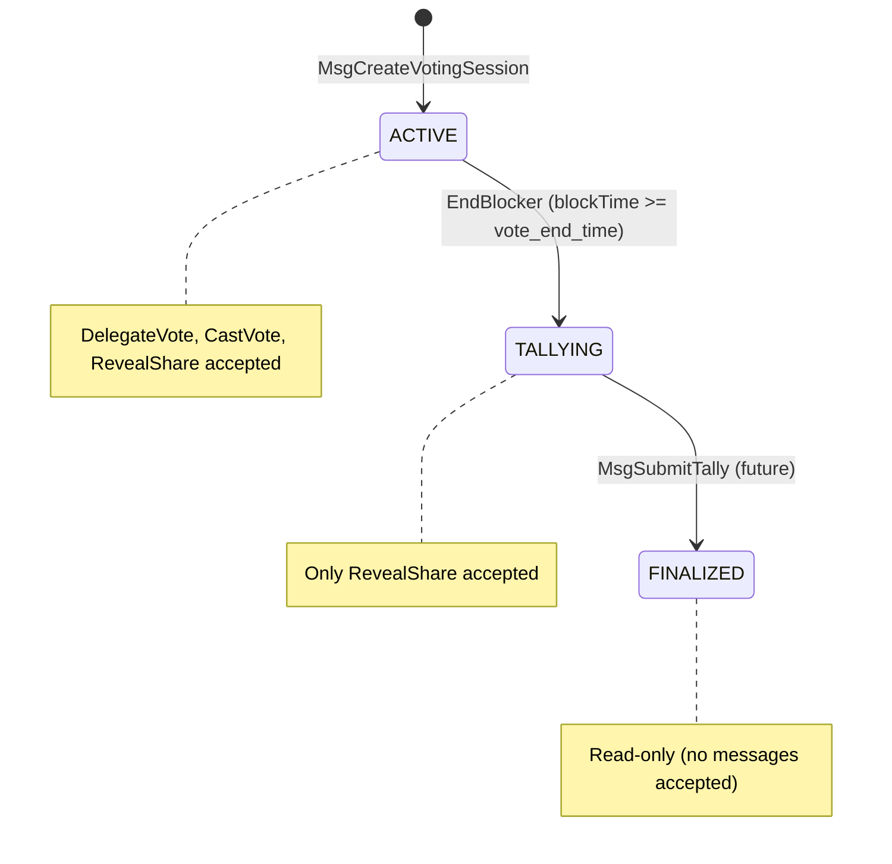

# Session Status Lifecycle

This document describes the `SessionStatus` state machine for `VoteRound`, including state transitions, per-status message acceptance rules, and the belt-and-suspenders validation strategy.

## State Machine



## SessionStatus Enum

| Value | Name | Description |
|-------|------|-------------|
| 0 | `SESSION_STATUS_UNSPECIFIED` | Default/zero value; should never appear on a stored round |
| 1 | `SESSION_STATUS_ACTIVE` | Voting is open; all message types accepted |
| 2 | `SESSION_STATUS_TALLYING` | Voting closed; only `MsgRevealShare` accepted |
| 3 | `SESSION_STATUS_FINALIZED` | Tally complete; round is read-only |

## Per-Status Message Acceptance

| Message Type | ACTIVE | TALLYING | FINALIZED |
|---|---|---|---|
| `MsgDelegateVote` | Accepted | **Rejected** | **Rejected** |
| `MsgCastVote` | Accepted | **Rejected** | **Rejected** |
| `MsgRevealShare` | Accepted | Accepted | **Rejected** |
| `MsgCreateVotingSession` | N/A (creates new round) | N/A | N/A |

This is implemented via the `AcceptsTallyingRound()` method on the `VoteMessage` interface:

- `MsgRevealShare.AcceptsTallyingRound()` returns `true` — routed to `ValidateRoundForShares`
- All other messages return `false` — routed to `ValidateRoundForVoting`

## Transitions

### ACTIVE → TALLYING

- **Trigger**: `EndBlocker` runs at the end of every block
- **Condition**: `blockTime >= round.VoteEndTime` for rounds with `status == SESSION_STATUS_ACTIVE`
- **Action**: Sets `status = SESSION_STATUS_TALLYING` via `UpdateVoteRoundStatus`
- **Event**: Emits `round_status_change` with attributes:
  - `vote_round_id`: hex-encoded round ID
  - `old_status`: `SESSION_STATUS_ACTIVE`
  - `new_status`: `SESSION_STATUS_TALLYING`

### TALLYING → FINALIZED

- **Trigger**: `MsgSubmitTally` (not yet implemented)
- **Condition**: Valid tally submission
- **Note**: The `SESSION_STATUS_FINALIZED` enum value is defined but the transition is not yet implemented. It is reserved for future `MsgSubmitTally` work.

## Belt-and-Suspenders Validation

`ValidateRoundForVoting` checks **both** the persistent `status` field AND `blockTime < vote_end_time`. This guards against the window between `vote_end_time` passing and the next `EndBlocker` run:

```
ValidateRoundForVoting(ctx, roundID):
  1. Round exists?             → ErrRoundNotFound
  2. Status == ACTIVE?         → ErrRoundNotActive (catches post-transition)
  3. blockTime < vote_end_time → ErrRoundNotActive (catches pre-transition)
```

`ValidateRoundForShares` is more permissive — it accepts both ACTIVE and TALLYING rounds:

```
ValidateRoundForShares(ctx, roundID):
  1. Round exists?                → ErrRoundNotFound
  2. Status == ACTIVE?            → OK (shares accepted during active voting)
  3. Status == TALLYING?          → OK (shares accepted during tally phase)
  4. Any other status (FINALIZED) → ErrRoundNotActive
```

When the round is ACTIVE but time has passed (EndBlocker hasn't run yet this block), `ValidateRoundForShares` still accepts the message because shares should be valid until the round is FINALIZED.

## Genesis

The `status` field is part of the `VoteRound` protobuf message, so `InitGenesis` and `ExportGenesis` automatically persist and restore it with no extra code needed.
