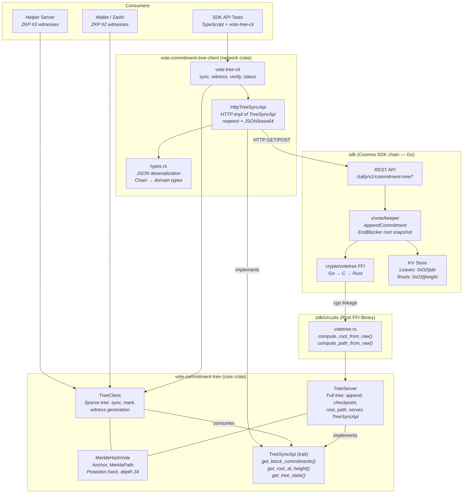
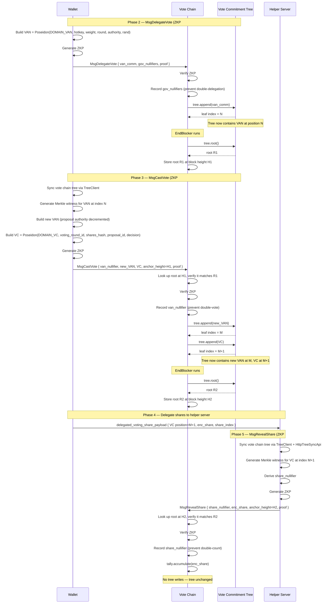
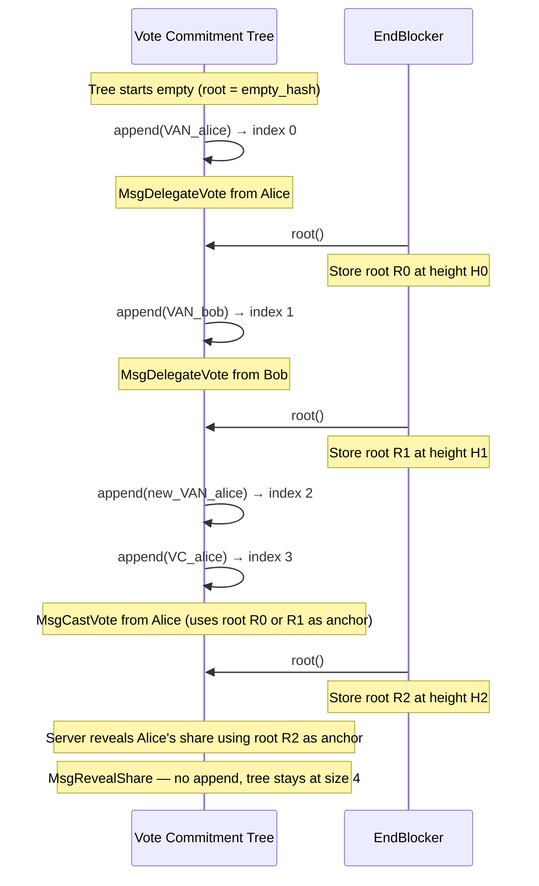
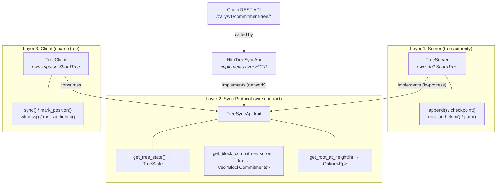
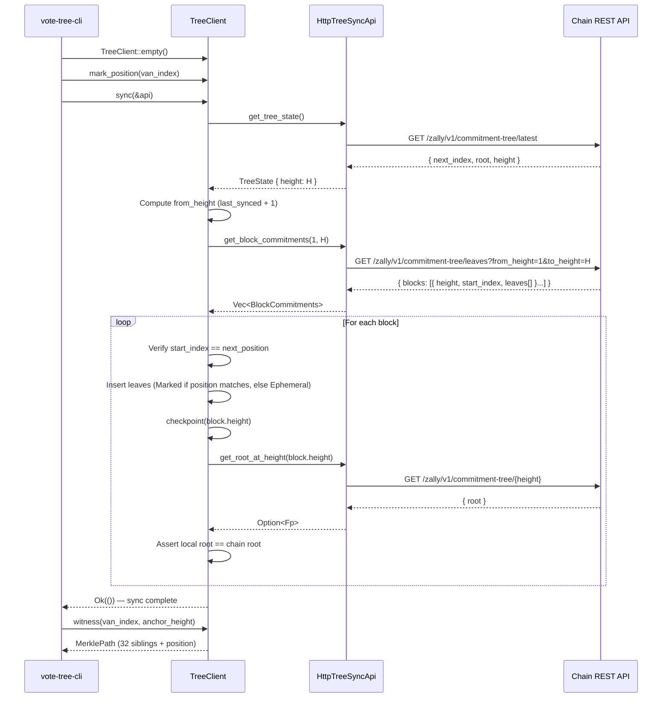
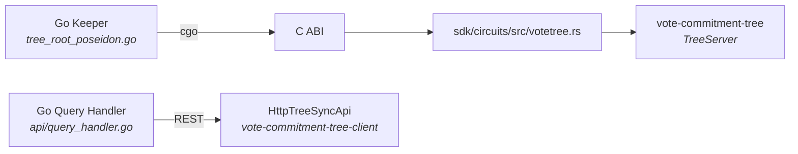
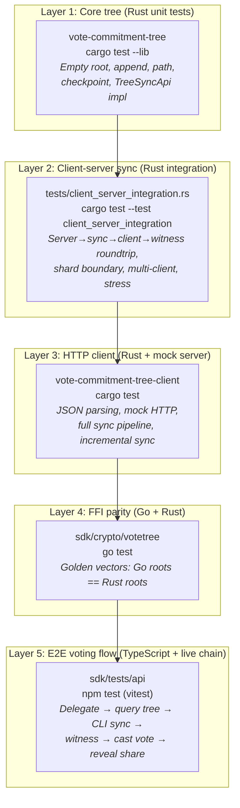

# vote-commitment-tree

Append-only Poseidon Merkle tree for the **Vote Commitment Tree** in the Zally voting protocol. This crate provides the tree structure, sync protocol, and witness generation used by the vote chain for ZKP #2 (VAN membership) and ZKP #3 (VC membership). The design follows **Gov Steps V1** and the **Wallet SDK → Cosmos SDK Messages** flow.

## Table of contents

- [Design sources](#design-sources)
- [Role in the protocol](#role-in-the-protocol)
- [What is an anchor?](#what-is-an-anchor)
- [How the tree participates in each message](#how-the-tree-participates-in-each-message)
- [How the note commitment tree works in ZCash](#how-the-note-commitment-tree-works-in-zcash)
- [How we modify this for the vote commitment tree](#how-we-modify-this-for-the-vote-commitment-tree)
- [Privacy model](#privacy-model)
- [Architecture overview](#architecture-overview)
- [Sync architecture](#sync-architecture)
- [CLI reference (`vote-tree-cli`)](#cli-reference-vote-tree-cli)
- [API reference](#api-reference)
- [Integration with the Go chain](#integration-with-the-go-chain)
- [Testing](#testing)
- [Where things live](#where-things-live)
- [Relationship to protocol spec](#relationship-to-protocol-spec)

---

## Design sources

The voting protocol is specified in two places; this README assumes that context.

| Source | Content |
|--------|--------|
| **Gov Steps V1** | Full protocol spec: glossary, Phase 0–5, ZKP #1 (delegation), ZKP #2 (vote), ZKP #3 (share reveal), El Gamal and tally appendices. In-repo ref: `docs/cosmos-sdk-messages-spec.md` (derived from Gov Steps V1). The canonical spec lives in the Obsidian vault `zcaloooors/Voting/Gov Steps V1.md` when the symlink is present. |
| **Wallet SDK Operations → Cosmos SDK Messages** (Figma) | [Figma board](https://www.figma.com/board/CCKJMV6iozvYV8mT6H050a/Wallet-SDK-V2?node-id=0-1): client flow (note identification, Keystone signing, ZKP #1/#2), helper server (share relay, ZKP #3), Cosmos messages (`MsgDelegateVote`, `MsgCastVote`, `MsgRevealShare`), and chain state (nullifier sets, vote commitment tree, encrypted tally). |

---

## Role in the protocol

- **Note commitment tree (ZCash mainnet)**: We only use its root `nc_root` at snapshot height as an anchor for ZKP #1. We do not build it in this repo.
- **Vote Commitment Tree (vote chain)**: This crate implements the tree structure that the vote chain maintains. The protocol specifies **one tree per voting round** (see [Relationship to protocol spec](#relationship-to-protocol-spec)); this crate provides a single tree instance — the chain is responsible for round scoping. The tree is append-only, fixed depth 24 (capacity 2^24 ≈ 16.7M leaves). Leaves are:
  - **Vote Authority Notes (VANs)** — from `MsgDelegateVote` and the new VAN from `MsgCastVote`
  - **Vote Commitments (VCs)** — from `MsgCastVote`

Domain separation (DOMAIN_VAN = 0, DOMAIN_VC = 1) is applied when *constructing* leaf values (in circuits / chain); this crate stores and hashes already-committed field elements.

## What is an anchor?

An **anchor** is a committed Merkle root at a fixed point in time that everyone treats as the single reference for checking Merkle proofs.

**Purpose:**

1. **Fixes the tree state.** The anchor is "the root of this tree at this height." Anyone can check that a Merkle path hashes to that root, so the proof is tied to that exact tree state.

2. **Prevents fake or inconsistent trees.** Without an anchor, a prover could use a different tree (or a different root) and still produce a valid-looking path. The verifier would have no agreed root to check against. The anchor is the value the chain has **published and committed to** at a given height.

3. **Time-binds the proof.** "At snapshot height, the note commitment tree had root `nc_root`" and "at vote-chain height H, the vote commitment tree had root R" are statements that bind proofs to a specific moment. That is what "anchor" means: the root you are anchoring your proof to.

**In this protocol there are two anchors:**

- **`nc_root` (Phase 0.2)** — note commitment tree root on **ZCash mainnet** at snapshot height. ZKP #1 checks note-inclusion proofs against this published root so that they target the real main-chain tree, not an invented one.

- **Vote commitment tree root at `vote_comm_tree_anchor_height`** — tree root on the **vote chain** at a given block height. ZKP #2 (VAN membership) and ZKP #3 (VC membership) prove inclusion against this root. The chain stores the root at each height via EndBlocker; provers use the root at their chosen anchor height, and the chain verifies the proof against the stored value.

In one sentence: **the anchor is the agreed Merkle root (and its height) that all inclusion proofs are verified against, so proofs are bound to a single, committed tree state.**

## How the tree participates in each message

Three messages interact with the tree. The first two **write** leaves into it; the third only **reads** from it (via a ZKP). Between blocks, EndBlocker **snapshots the root** so later messages can reference it as an anchor.

### MsgDelegateVote (Phase 2 — ZKP #1) — WRITE only

**What happens:** A voter delegates their mainchain ZEC notes to a voting hotkey. The chain verifies ZKP #1, records governance nullifiers, and **appends the VAN** (the governance commitment `van_comm`) as a new leaf in the tree.

**Tree's role:** Storage. The VAN is planted into the tree so that future ZKP #2 proofs can prove membership of this VAN. At this point nobody reads from the tree — the tree just grows.

**Why it matters:** Without this append, there would be no leaf for ZKP #2 to prove inclusion against. The VAN must be in the tree before the voter can cast a vote.

```
MsgDelegateVote  ──  tree relationship
─────────────────────────────────────────
  ZKP #1 proves:  "I own unspent ZCash notes"
                  (uses nc_root from mainchain, NOT the vote tree)

  Chain action:   tree.append(van_comm)   ← VAN goes in as a new leaf
                  tree now has this VAN at index N
```

### MsgCastVote (Phase 3 — ZKP #2) — READ then WRITE

**What happens:** The voter casts an encrypted vote on a proposal. ZKP #2 proves that the voter's **old VAN is already in the tree** (read), then the chain **appends two new leaves** (write): the new VAN (with decremented proposal authority) and the vote commitment (VC).

**Tree's role — read side:** The prover builds a Merkle inclusion proof for the old VAN against the tree root at a specific anchor height (`vote_comm_tree_anchor_height`). The chain looks up the stored root at that height and the ZKP is verified against it. This proves "I hold a registered VAN" without revealing which one.

**Tree's role — write side:** Two new leaves are appended:
1. **New VAN** — same voter, same weight, but proposal authority decremented by 1. This VAN can be spent again to vote on another proposal.
2. **Vote commitment (VC)** — commits to the 4 encrypted shares, proposal ID, and vote decision. This VC will later be opened by ZKP #3.

```
MsgCastVote  ──  tree relationship
─────────────────────────────────────────
  ZKP #2 proves:  "My old VAN is in the tree at anchor root R"
                  (Merkle inclusion proof against vote_comm_tree_root)

  Chain checks:   root_at_height(anchor_height) == R   ← anchor validation
                  van_nullifier not seen before         ← no double-vote

  Chain action:   tree.append(vote_authority_note_new)  ← new VAN, leaf N
                  tree.append(vote_commitment)          ← VC, leaf N+1
```

### MsgRevealShare (Phase 5 — ZKP #3) — READ only

**What happens:** The helper server reveals one encrypted share from a registered vote commitment. ZKP #3 proves that the **VC is in the tree** (read). The chain does NOT write any new leaves.

**Tree's role:** The prover builds a Merkle inclusion proof for the VC against the tree root at a specific anchor height. This proves "this share comes from a real, registered vote commitment" without revealing which VC it came from. The chain then accumulates the encrypted share into the homomorphic tally.

```
MsgRevealShare  ──  tree relationship
─────────────────────────────────────────
  ZKP #3 proves:  "This VC is in the tree at anchor root R"
                  "This enc_share is one of the 4 shares in that VC"
                  (Merkle inclusion proof against vote_comm_tree_root)

  Chain checks:   root_at_height(anchor_height) == R   ← anchor validation
                  share_nullifier not seen before       ← no double-count

  Chain action:   tally.accumulate(enc_share)           ← homomorphic add
                  (no tree writes)
```

### EndBlocker — ROOT SNAPSHOT

Between blocks, EndBlocker computes the current tree root and stores it at the block height. This stored root becomes the **anchor** that future MsgCastVote and MsgRevealShare reference when they say "prove inclusion against the tree root at height H."

```
EndBlocker  ──  tree relationship
─────────────────────────────────────────
  if tree grew this block:
    root = tree.root()
    store root at current block height   ← this root becomes a valid anchor
```

---

## How the note commitment tree works in ZCash

To understand the vote commitment tree, it helps to understand the structure it mirrors.

### Structure

ZCash maintains a separate **append-only Merkle tree** per shielded pool (Sprout depth 29, Sapling depth 32, Orchard depth 32). Each tree stores **note commitments** — one per shielded output created on-chain. A note commitment is a hash that binds the note's contents (recipient address, value, randomness) without revealing them.

```
                       root
                      /    \
                   h01      h23
                  /   \    /   \
                h0    h1  h2   h3        ← internal nodes: MerkleCRH(layer, left, right)
               /  \  / \  / \  / \
              c0 c1 c2 c3 c4 c5 c6 c7   ← leaf layer: note commitments (or Uncommitted)
              ↑           ↑
           note 0       note 4
```

Key properties:

- **Append-only.** Notes are added at the next available leaf position. No deletions. The tree only grows.
- **Uncommitted leaves.** Unused slots hold a distinguished "Uncommitted" value (e.g. `Fp::one()` for Orchard). This makes empty subtrees deterministic.
- **Layer-tagged hashing.** Internal nodes are `MerkleCRH(layer, left, right)`. For Orchard this is Sinsemilla; for our vote tree it is Poseidon (without the layer tag — just `Poseidon(left, right)`).
- **Root = anchor.** The root at a given block height is the anchor used in spend proofs. A spender proves their note is in the tree by providing a Merkle path from leaf to root, and the verifier checks that root matches a published anchor.

### How the wallet syncs the tree (ZCash mainchain)

The wallet does not store the full tree. It uses **ShardTree** (from the `incrementalmerkletree` / `shardtree` crates) — a sparse representation that only materializes the subtrees needed for witnesses.

**Step 1 — Download compact blocks.** The wallet connects to lightwalletd and streams `CompactBlock` messages. Each contains compact transactions, and each compact transaction contains note commitments:
- Sapling: `cmu` (u-coordinate of Jubjub point)
- Orchard: `cmx` (x-coordinate of Pallas point)

**Step 2 — Trial-decrypt.** For each note commitment, the wallet tries to decrypt the associated ciphertext with its viewing keys. If decryption succeeds, the wallet "marks" that note's position in the tree (via `Retention::Marked`) so the tree retains the subtree needed for a future witness.

**Step 3 — Insert into ShardTree.** The commitments are batch-inserted into the local ShardTree:
```
commitments = [(Node::from_cmx(cmx), Retention)]   // one per output in the block
tree.insert_tree(subtree_from_commitments)
tree.checkpoint(block_height)                        // snapshot for future rollbacks
```

**Step 4 — Subtree root acceleration.** lightwalletd also serves pre-computed subtree roots (one per 2^16 leaves). The wallet inserts these via `put_sapling_subtree_roots` / `put_orchard_subtree_roots`, which fills in the "cap" of the tree without needing every leaf — this is how fast-sync works.

**Step 5 — Witness generation.** When the wallet wants to spend a note, it calls:
```
tree.witness_at_checkpoint_id_caching(note_position, anchor_height)
    → Option<MerklePath>
```
This returns the sibling hashes from the leaf to the root at the given checkpoint height.

### Summary of the ZCash wallet tree API surface

| API | What it does |
|---|---|
| `CompactBlock` (from lightwalletd) | Delivers `cmx` / `cmu` per output per block |
| `ShardTree::insert_tree(subtree)` | Batch-insert note commitments from scanned blocks |
| `ShardTree::checkpoint(height)` | Snapshot current tree state for witness queries |
| `put_subtree_roots(roots)` | Fast-sync: insert pre-computed subtree roots |
| `witness_at_checkpoint_id_caching(pos, height)` | Get Merkle path for a marked note at an anchor height |
| `ShardTree::root_at_checkpoint_id(height)` | Get tree root at a given checkpoint |

## How we modify this for the vote commitment tree

Our vote commitment tree is structurally the same (append-only, fixed-depth Merkle) but differs in important ways. The wallet needs new sync logic for the vote chain.

### Differences from ZCash's note commitment tree

| Aspect | ZCash mainchain | Vote commitment tree |
|---|---|---|
| Hash function | Sinsemilla (Sapling/Orchard) | **Poseidon** (cheaper in-circuit) |
| Layer tagging | Sinsemilla prepends 10-bit level prefix | **No layer tag** — `Poseidon(left, right)` is the same at every level ([rationale](#no-layer-tagging-in-poseidon-combine)) |
| Depth | 32 | **24** ([rationale](#tree-depth-choice)) |
| Leaf contents | Note commitments only | **Both VANs and VCs** (domain-separated) |
| Where it lives | ZCash mainnet | **Vote chain** (Cosmos SDK) |
| Block format | CompactBlock via lightwalletd | Vote chain blocks via REST API (`/zally/v1/commitment-tree/leaves`) |
| Who inserts | ZCash consensus (every shielded output) | Vote chain consensus (MsgDelegateVote, MsgCastVote) |
| Who needs witnesses | Spender (for spend proofs) | **Voter** (ZKP #2) and **helper server** (ZKP #3) |

### Wallet sync for the vote chain tree

The wallet needs to maintain a local copy of the vote commitment tree so it can produce Merkle paths for ZKP #2. The helper server needs the same for ZKP #3. Both use `TreeClient` which syncs incrementally via the `TreeSyncApi` trait.

**Step 1 — Connect to the vote chain.** The wallet (or helper server) creates a `TreeClient` and syncs from the chain via a `TreeSyncApi` implementation. In the POC this is in-process; in production the `HttpTreeSyncApi` (from `vote-commitment-tree-client`) connects to the chain's REST API:

```rust
// In-process (tests / POC)
let mut client = TreeClient::empty();
client.sync(&server)?;

// Over HTTP (production / CLI)
let api = HttpTreeSyncApi::new("http://localhost:1317");
let mut client = TreeClient::empty();
client.sync(&api)?;
```

Under the hood, `sync` calls `get_block_commitments(from_height, to_height)` to fetch leaves per block. For each block it inserts every leaf and calls `checkpoint(height)`. The root at each checkpoint is verified against the chain's stored root (consistency check).

**Step 2 — Mark your positions and generate witnesses.** The wallet knows its own VAN index from when it submitted MsgDelegateVote. It marks that position and generates a witness:

```rust
client.mark_position(my_van_index);
let witness = client.witness(my_van_index, anchor_height).unwrap();
let root = client.root_at_height(anchor_height).unwrap();
// witness.verify(my_van_leaf, root) == true
```

Similarly, when the wallet submits a MsgCastVote, it stores the VC leaf index and sends it to the helper server in the `delegated_voting_share_payload`.

**Step 3 — Helper server sync.** The helper server runs the same sync loop with its own `TreeClient`. When it receives a share payload with a VC position, it marks that position and generates a witness for ZKP #3:

```rust
let api = HttpTreeSyncApi::new("http://chain-node:1317");
let mut helper_client = TreeClient::empty();
helper_client.mark_position(vc_index);
helper_client.sync(&api)?;
let witness = helper_client.witness(vc_index, anchor_height).unwrap();
```

### What we reuse from ZCash

- **The append-only Merkle tree concept** — same structure, just different hash and contents.
- **`incrementalmerkletree` / `shardtree` crates** — this crate is built directly on the same tree infrastructure as Orchard. `MerkleHashVote` implements `Hashable` (with Poseidon instead of Sinsemilla), and the tree is a `ShardTree<MemoryShardStore<...>, 32, 4>`. Wallets and helper servers only need Merkle paths for their own positions (wallet: its VAN for ZKP #2; server: delegated VCs for ZKP #3), not for arbitrary leaves — the same sparse-witness situation as Zcash.
- **Witness = Merkle path** — same concept. `tree.path(position, anchor_height)` returns siblings from leaf to root, same shape as ZCash's `MerklePath`.
- **Anchor = root at height** — same concept. `tree.root_at_height(h)` returns the root at a checkpoint. The wallet picks an anchor height, uses that root, and builds the ZKP against it.

### What is new

- **No trial decryption.** All leaves in the vote tree are public (VAN and VC values are public inputs to the chain). The wallet does not need to decrypt anything — it just appends every leaf it sees. Position discovery is trivial: the wallet knows its own VAN index from when it submitted MsgDelegateVote.
- **Sparse witnesses apply the same way as Zcash.** A wallet only needs a Merkle path for its own VAN (ZKP #2). A helper server only needs paths for the specific VCs it was delegated (ZKP #3). Neither needs paths for every leaf. Both still must receive all leaves (or subtree roots) to keep sibling hashes current, but only the subtrees touching their marked positions need to be materialized — exactly as ShardTree works for Zcash wallets.
- **Poseidon hash function.** Must match the circuit's Poseidon (P128Pow5T3 over Pallas Fp). This crate uses the same `PoseidonHasher` as `imt-tree`.

### No layer tagging in Poseidon `combine`

Orchard's Sinsemilla hashes internal nodes as `Sinsemilla(level_prefix || left || right)`, where the 10-bit level prefix acts as domain separation across tree depths. This prevents **second-preimage attacks across levels**: without a level tag, a valid internal node at level *k* could be reinterpreted as a leaf (or a node at a different level) to construct a fraudulent Merkle path that still hashes to the correct root.

Our vote commitment tree does **not** include the level in Poseidon:

```rust
// hash.rs
fn combine(_level: Level, left: &Self, right: &Self) -> Self {
    MerkleHashVote(poseidon_hash(left.0, right.0))
}
```

This is a deliberate choice. Three properties make the attack infeasible in our setting:

1. **Fixed depth enforced by circuits.** ZKP #2 and ZKP #3 hardcode `TREE_DEPTH = 24` — every Merkle path verified in-circuit has exactly 24 sibling hashes. The verifier rejects paths of any other length, so an attacker cannot present an internal node as a leaf in a "shorter" tree. The level ambiguity only matters if the verifier accepts variable-depth proofs, which ours does not.

2. **Consensus-gated insertion.** Only `MsgDelegateVote` and `MsgCastVote` can append leaves, and both require valid ZKPs verified on-chain. An attacker cannot insert an arbitrary field element as a leaf — they must produce a valid delegation proof (ZKP #1) or vote proof (ZKP #2).

3. **Domain-separated commitments with randomness.** Leaves are `Poseidon(DOMAIN_VAN, hotkey, weight, round, authority, rand)` or `Poseidon(DOMAIN_VC, voting_round_id, shares_hash, proposal_id, decision)`. The probability that such a commitment collides with an internal node value `Poseidon(left_child, right_child)` is ~1/2^254 (negligible over the Pallas field).

Property (1) alone is sufficient: even if an attacker could somehow produce a leaf equal to an internal node, the circuit would still require a 24-element path from that leaf to the root. The "reinterpret the tree at a different depth" attack is structurally impossible.

**Trade-off**: Omitting the level tag saves one constraint per hash in the circuit's Merkle path verification (no level field element to allocate or constrain). Over 24 levels that is 24 fewer constraints per ZKP #2 / ZKP #3 proof, with no security cost given the properties above.

**If this changes**: If the protocol ever allows variable-depth proofs or adversarial leaf insertion without a ZKP gate, layer tagging should be revisited. Adding it later would change every tree root, Merkle path, and on-chain anchor — effectively a hard fork.

### Tree depth choice

The vote commitment tree uses **depth 24** (2^24 ≈ 16.7M leaf capacity), reduced from Zcash's depth 32 (~4.3B). This is deliberate because governance voting produces far fewer leaves than a full shielded transaction pool.

**Usage analysis:** Each voter generates 1 leaf per delegation (`MsgDelegateVote`) + 2 leaves per vote (`MsgCastVote`). For V voters voting on P proposals: V(1 + 2P) leaves.

| Scenario | Voters | Proposals | Leaves | Fits in depth... |
|---|---|---|---|---|
| Small round | 500 | 5 | 5,500 | 13+ |
| Medium round | 5,000 | 10 | 105,000 | 17+ |
| Large round | 10,000 | 50 | 1,010,000 | 20+ |
| 100 large rounds | 10,000 | 50 | 101,000,000 | 27+ |

Depth 24 provides comfortable headroom for any realistic governance scenario — over 165 "large" rounds before filling the tree.

**Performance gains vs depth 32:**

| Metric | Depth 32 | Depth 24 | Improvement |
|---|---|---|---|
| Poseidon hashes per ZKP | 32 | 24 | 8 fewer (~2,000 constraints) |
| MerklePath size | 1,028 bytes | 772 bytes | 25% smaller |
| Leaf capacity | 4.3 billion | 16.7 million | Right-sized |

**If this needs to change:** Increasing the depth later changes every root, Merkle path, and on-chain anchor — effectively a hard fork. Depth 24 is chosen to avoid that scenario while not over-provisioning.

## Privacy model

The protocol provides **voter anonymity and ballot secrecy**. An observer cannot determine who voted, how they voted, or how much voting weight they carry.

### Cryptographic protections

Three mechanisms protect voter identity:

1. **Re-randomized spend authorization (`rk`).** MsgDelegateVote carries a re-randomized verification key `rk`, not the voter's actual spending key. The Keystone hardware wallet signs with the real key, but only `rk` goes on-chain. The chain verifies the signature against `rk`. Two delegations from the same voter produce different, unlinkable `rk` values — the same mechanism Zcash uses to prevent spend-graph analysis.

2. **No account-based authentication.** Vote transactions bypass the Cosmos SDK Tx envelope and use ZKP + RedPallas authentication instead of standard Cosmos signatures. There are no Cosmos accounts, no gas fees, and no sender address on-chain. A transaction is authenticated solely by its ZKP proof and `rk` signature — there is no account identity to link.

3. **Hiding commitments.** The VAN is `Poseidon(DOMAIN_VAN, hotkey, weight, round, authority, rand)` — the blinding factor `rand` makes the commitment hiding. An observer who sees the leaf value cannot extract the hotkey, weight, or any identifying information.

### What is visible on-chain

An observer who scans the chain sees the following per transaction, but **cannot link any of it to a real-world identity or Zcash address**:

| Visible | Source | Why it does not identify the voter |
|---|---|---|
| A delegation occurred | `MsgDelegateVote` transaction | No sender address; authenticated by ZKP #1 + `rk` signature |
| Re-randomized key `rk` | `MsgDelegateVote.rk` | Re-randomized per transaction; unlinkable to the spending key |
| A vote was cast on Proposal 7 | `MsgCastVote` transaction | No sender address; ZKP #2 hides which VAN was consumed |
| Leaf indices of new VANs and VCs | Event attributes (`leaf_index`) | Leaf values are hiding commitments; index alone reveals nothing |
| Governance nullifiers | `MsgDelegateVote.gov_nullifiers` | One-time values that prevent double-delegation; cannot be traced to specific Zcash notes |

### What is hidden

| Secret | Protected by |
|---|---|
| **Who voted** (voter identity) | `rk` re-randomization (unlinkable to spending key) + no account-based authentication |
| **Vote decision** (how they voted) | Encrypted in the vote commitment (VC); accumulated via homomorphic addition into the tally |
| **Voting weight** (how much ZEC backs the vote) | Hidden in the VAN commitment preimage (`rand` makes it hiding) |
| **Which Zcash notes back the delegation** | ZKP #1 proves note ownership without revealing which mainchain UTXOs are used |
| **Which VAN was consumed when voting** | ZKP #2 proves VAN membership without revealing the leaf position |
| **Which VC a revealed share came from** | ZKP #3 (submitted by the helper server, not the voter) proves VC membership without revealing the position |

### No Cosmos account linkage

Vote transactions bypass the Cosmos SDK Tx envelope entirely and use ZKP + RedPallas authentication instead of standard Cosmos signatures (see `module.go`: the standard `SigVerificationDecorator` is replaced with custom ZKP/RedPallas validation in the AnteHandler). There are no Cosmos accounts, no Cosmos signatures, and no gas fees. Transactions are authenticated purely by the ZKP proofs and the re-randomized `rk` signature — there is no account address that could link two transactions to the same voter.

This means the full anonymity set for ZKP #2 is the **entire tree** (all VANs from all voters). The only remaining non-cryptographic linkage vector is **timing analysis** — if only one delegation and one vote arrive in a short window, timing alone may correlate them. The protocol already includes a random delay for helper server share reveals (Phase 5); similar batching or delay for delegation and vote submission strengthens anonymity.

### Why this is not a risk

The protocol's cryptographic layer fully protects the three properties that matter for a voting system:

1. **Ballot secrecy.** Vote decisions are encrypted in the VC and never appear in plaintext on-chain. The tally is computed homomorphically — only the aggregate result is revealed.
2. **Weight privacy.** Voting weight is hidden inside the VAN commitment. An observer cannot determine how much ZEC backs any vote.
3. **Voter anonymity.** There are no Cosmos accounts or sender addresses on vote transactions. The `rk` re-randomization ensures that on-chain data cannot be traced back to a Zcash identity or spending key. ZKP #1 hides the source notes; ZKP #2 hides the consumed VAN; ZKP #3 hides the share-to-voter link.
4. **Share-to-voter unlinkability.** The helper server (not the voter) submits `MsgRevealShare`, and ZKP #3 proves VC membership without revealing which VC the share came from.

### Wallet recovery and position rediscovery

Unlike Zcash, there is no trial decryption — the wallet discovers its leaf positions at submission time (`MsgDelegateVote` returns the VAN index, `MsgCastVote` returns the new VAN and VC indices) rather than by scanning the tree with a viewing key.

After a wallet reset, positions can be recovered by querying the wallet's own transaction history on the vote chain (the `leaf_index` event attribute records the indices). This does not leak any information beyond what is already public from the transactions themselves.

We currently do not implement the ability to recover. This can be done in the future.

The VAN preimage (specifically the `rand` blinding factor) must be recoverable for the wallet to produce future ZKPs. If `rand` is derived deterministically from the wallet seed (e.g., `rand = PRF(seed, round_id, counter)`), full recovery is possible. If `rand` is truly random and only stored locally, it is lost on reset and the VAN cannot be spent — this is a wallet-implementation concern, not a protocol-level risk.

---

## Architecture overview

### Full-stack component diagram



### Protocol flow: Delegate → Vote → Reveal



### Tree growth over time



### Server-side vs client-side tree

`TreeServer` and `TreeClient` wrap the **same underlying data structure** — `ShardTree<MemoryShardStore<MerkleHashVote, u32>, 32, 4>` from Zcash's `shardtree` crate. The difference is how leaves enter and what gets retained.

#### What they share

Both sides use identical:
- **Backing store**: `MemoryShardStore<MerkleHashVote, u32>` (in-memory shard storage, checkpoint ID = `u32` block height)
- **Tree params**: `TREE_DEPTH = 24`, `SHARD_HEIGHT = 4` (each shard covers 2^4 = 16 leaves), `MAX_CHECKPOINTS = 1000`
- **Hash function**: `MerkleHashVote` implementing `Hashable` with `Poseidon(left, right)` — no layer tag
- **Witness generation**: `inner.witness_at_checkpoint_id(pos, &height)` wrapped in `MerklePath`
- **Root lookup**: `inner.root_at_checkpoint_id(&height)`

#### TreeServer (full tree — chain authority)

The server is the **source of truth**. The chain consensus layer calls `append()` / `append_two()` directly, and every leaf is inserted with `Retention::Marked` so the server can generate witnesses for any position at any checkpoint.

Extra state beyond the ShardTree:
- `blocks: BTreeMap<u32, BlockCommitments>` — completed block data, populated on `checkpoint()`. This is the data source for `TreeSyncApi`.
- `pending_leaves: Vec<MerkleHashVote>` + `pending_start: u64` — accumulates leaves for the current (not yet checkpointed) block.

The server also **implements `TreeSyncApi`** so clients can fetch block-level leaf batches and roots from it.

In production, the Go keeper stores leaves in KV (`0x02 || big-endian index → 32-byte Fp`) and the Rust FFI (`sdk/circuits/src/votetree.rs`) rebuilds a `TreeServer` from raw bytes to compute roots and paths.

#### TreeClient (sparse tree — wallet / helper server)

The client is a **sparse mirror**. It does not receive leaves from consensus — it fetches them via `sync(api)` from a `TreeSyncApi` source and replays them locally. The key difference is **selective retention**:

```rust
let retention = if self.marked_positions.contains(&self.next_position) {
    Retention::Marked
} else {
    Retention::Ephemeral
};
```

Only positions in the `marked_positions` set get `Retention::Marked`; everything else is `Retention::Ephemeral` (prunable). This is what makes the tree **sparse** — ShardTree only materializes the subtrees touching marked positions. A wallet with one VAN at position 0 in a tree of 100,000 leaves only retains the ~24 sibling hashes along the path from position 0 to root, not all 100K leaves.

Extra state beyond the ShardTree:
- `marked_positions: BTreeSet<u64>` — positions the client cares about (wallet: its VAN; helper server: delegated VCs).
- `last_synced_height: Option<u32>` — tracks incremental sync progress.

During sync, the client validates two safety invariants per block:
1. **Start index continuity** — each block's `start_index` must match the client's expected next position (catches missed or duplicated blocks).
2. **Root consistency** — the client's computed root after each checkpoint must match the server's root at that height (catches corrupted data, hash mismatches, or implementation differences).

#### Comparison

| | TreeServer | TreeClient |
|---|---|---|
| Leaf source | Direct `append()` (chain consensus) | Indirect via `sync()` from `TreeSyncApi` |
| Retention policy | All `Marked` (full tree) | Selective: only `marked_positions` are `Marked`, rest `Ephemeral` (sparse) |
| Extra bookkeeping | `blocks` BTreeMap + `pending_leaves` (serves sync data) | `marked_positions` BTreeSet + `last_synced_height` (tracks sync) |
| Who uses it | Chain keeper (Go FFI), POC tests | Wallet (ZKP #2), helper server (ZKP #3), CLI |
| Witness scope | Any position (all marked) | Only pre-registered positions |
| Root authority | Source of truth | Verifies against server after each block |
| Production storage | Go KV store + Rust FFI rebuild | In-memory (`MemoryShardStore`) |

#### Zcash parallel

This is exactly how Zcash wallets work with Orchard's note commitment tree:
- **zcashd / zebrad** maintains the full tree (analogous to `TreeServer`)
- **Zashi / zcash_client_sqlite** maintains a sparse `ShardTree` (analogous to `TreeClient`), only marking notes the wallet owns for future spend witnesses

The difference from Zcash is that all vote-tree leaves are public (no trial decryption), so the client marks known positions by index rather than discovering them through decryption.

---

## Sync architecture

The sync system has three clearly separated layers so that server and client evolve independently and the wire format is the only contract.

### Layer diagram



### Sync sequence (client syncing from chain)



### Wire format

The sync protocol uses three message types. In the POC the server implements `TreeSyncApi` directly (in-process, `Error = Infallible`). In production, `HttpTreeSyncApi` maps them to the chain's REST API:

| TreeSyncApi method | REST endpoint | Request | Response |
|---|---|---|---|
| `get_tree_state()` | `GET /zally/v1/commitment-tree/latest` | — | `{ next_index, root (base64), height }` |
| `get_root_at_height(h)` | `GET /zally/v1/commitment-tree/{h}` | height in path | `{ root (base64), height }` |
| `get_block_commitments(from, to)` | `GET /zally/v1/commitment-tree/leaves?from_height=X&to_height=Y` | query params | `{ blocks: [{ height, start_index, leaves[] }] }` |

Field elements are 32-byte Pallas Fp values, serialized as little-endian bytes and base64-encoded over the wire.

### Design decisions

- **Server uses ShardTree internally** (not a simpler structure). This keeps the POC code path identical to production. In production, the Go keeper stores leaves in KV and the Rust FFI builds the ShardTree from them; the POC just skips the Go layer.
- **Client also uses ShardTree.** Same crate, same types, but populated via sync rather than direct appends. This mirrors how Zcash wallets work (see `zcash_client_memory/src/wallet_commitment_trees.rs`).
- **`TreeSyncApi` is a trait, not concrete types.** Makes it trivial to swap the in-process POC implementation for a network client (gRPC/REST) in production — and both implementations already exist.
- **All leaves are public.** Unlike Zcash, no trial decryption. The client inserts every leaf it receives. Position discovery is trivial (wallet knows its own VAN index from when it submitted MsgDelegateVote).
- **Root verification during sync.** The client verifies its local root against the chain's root after each checkpoint. A `RootMismatch` error indicates either a bug in the tree implementation, corrupted data on the wire, or a chain fork.

### Fast sync optimization (future)

For clients joining late (or the helper server bootstrapping), replaying every leaf from genesis is slow. The planned optimization uses **pre-computed subtree roots** — the same approach Zcash's lightwalletd uses for wallet fast-sync (`put_orchard_subtree_roots`).

Each shard covers `2^4 = 16` leaves. Once full, its root is deterministic and never changes. The server caches these and serves them via a future `get_subtree_roots()` method on `TreeSyncApi`. The client inserts subtree roots at shard-level addresses, skipping individual leaf insertion for completed shards. This gives a **16x bandwidth reduction** (subtree roots vs full leaves).

---

## CLI reference (`vote-tree-cli`)

The `vote-commitment-tree-client` crate provides a CLI binary for interacting with the vote commitment tree on a live chain.

### Commands

```bash
# Sync the full tree from a chain node, verify roots
vote-tree-cli sync --node http://localhost:1317

# Sync with marked positions (for future witness generation)
vote-tree-cli sync --node http://localhost:1317 --mark 0,3

# Generate a Merkle witness for a leaf position
vote-tree-cli witness --node http://localhost:1317 --position 0

# Generate witness at a specific anchor height
vote-tree-cli witness --node http://localhost:1317 --position 0 --anchor-height 5

# Verify a witness offline (no network)
vote-tree-cli verify --leaf <hex> --witness <hex> --root <hex>

# Check chain tree state (no local sync)
vote-tree-cli status --node http://localhost:1317
```

### Output format

The `sync` command prints:
```
Remote tree state:
  height:     2
  next_index: 4
  root:       <64 hex chars>

Syncing from genesis to height 2...
Sync complete.
  leaves synced:     4
  last synced height: 2
  local root:        <64 hex chars>
  root match:        OK
```

The `witness` command outputs the Merkle path as hex (772 bytes = 4-byte position + 24 sibling hashes × 32 bytes) and the anchor root. This output is consumed by the SDK's TypeScript API tests via `runTreeCli()`.

---

## API reference

### Shared types

- **`MerkleHashVote`** — leaf/node digest (newtype around `Fp`). Implements `Hashable`.
- **`Anchor`** — committed tree root at a block height. Newtype around `Fp` with `from_bytes` / `to_bytes`.
- **`MerklePath`** — authentication path with `root(leaf) -> Anchor` and `verify(leaf, root) -> bool`.

### `TreeServer` (server-side full tree)

Wraps `ShardTree<MemoryShardStore<MerkleHashVote, u32>, 32, 4>`. Owns the authoritative tree, appends leaves, creates checkpoints, and serves data to clients via `TreeSyncApi`.

| Method | Description |
|---|---|
| `TreeServer::empty()` | Create an empty tree |
| `append(leaf: Fp) -> u64` | Append one leaf (e.g. VAN from `MsgDelegateVote`); returns leaf index |
| `append_two(first, second) -> u64` | Append two leaves (e.g. new VAN + VC from `MsgCastVote`); returns first index |
| `checkpoint(height: u32)` | Snapshot tree state at block height (called by EndBlocker) |
| `root() -> Fp` | Current root (at latest checkpoint) |
| `root_at_height(height) -> Option<Fp>` | Root at a specific checkpoint (anchor lookup) |
| `size() -> u64` | Number of leaves appended |
| `path(position, anchor_height) -> Option<MerklePath>` | Witness for a leaf at a checkpoint height |

### `TreeSyncApi` (communication boundary)

Trait defining the contract between server and client. The server implements it directly for in-process use (POC/tests). `HttpTreeSyncApi` implements it over HTTP for production.

| Method | In-process | HTTP (production) |
|---|---|---|
| `get_block_commitments(from_h, to_h)` | Direct access to server data | `GET /zally/v1/commitment-tree/leaves?from_height=X&to_height=Y` |
| `get_root_at_height(h)` | Direct root lookup | `GET /zally/v1/commitment-tree/{height}` |
| `get_tree_state()` | Direct state access | `GET /zally/v1/commitment-tree/latest` |

Supporting types:

| Type | Fields | Purpose |
|---|---|---|
| `BlockCommitments` | `height`, `start_index`, `leaves` | Leaves appended in one block |
| `TreeState` | `next_index`, `root`, `height` | Current server tree tip |

### `TreeClient` (client-side sparse tree)

Wraps its own `ShardTree<MemoryShardStore<MerkleHashVote, u32>, 32, 4>`, populated via sync rather than direct appends. Used by wallets (for ZKP #2 witnesses) and helper servers (for ZKP #3 witnesses).

| Method | Description |
|---|---|
| `TreeClient::empty()` | Create an empty client tree |
| `sync(api: &impl TreeSyncApi)` | Incremental sync: fetch block commitments, insert leaves, checkpoint |
| `mark_position(pos: u64)` | Mark a leaf position for witness generation (own VAN or delegated VC) |
| `witness(pos, anchor_height) -> Option<MerklePath>` | Generate Merkle path for a marked position |
| `root_at_height(height) -> Option<Fp>` | Verify local root matches server (anchor check) |
| `root() -> Fp` | Current root at latest synced checkpoint |
| `size() -> u64` | Number of leaves synced |
| `last_synced_height() -> Option<u32>` | Latest synced block height |

### `HttpTreeSyncApi` (network client)

HTTP implementation of `TreeSyncApi` in the `vote-commitment-tree-client` crate. Uses `reqwest::blocking::Client` for synchronous HTTP calls. JSON responses use base64-encoded field elements matching the Go chain's `encoding/json.Marshal` output.

```rust
use vote_commitment_tree_client::http_sync_api::HttpTreeSyncApi;

let api = HttpTreeSyncApi::new("http://localhost:1317");
// or with custom client:
let api = HttpTreeSyncApi::with_client(custom_client, "http://chain:1317");
```

### Usage example

```rust
use vote_commitment_tree::{TreeServer, TreeClient, TreeSyncApi};
use pasta_curves::Fp;

// Server side (chain / keeper)
let mut server = TreeServer::empty();

// MsgDelegateVote: append VAN
let van_idx = server.append(Fp::from(100));
server.checkpoint(1); // EndBlocker

// MsgCastVote: append new VAN + VC
server.append_two(Fp::from(200), Fp::from(300));
server.checkpoint(2); // EndBlocker

// Client side (wallet / helper server)
let mut client = TreeClient::empty();
client.mark_position(van_idx);
client.sync(&server).unwrap(); // fetches blocks 1-2

// Generate witness for VAN at position 0, anchor height 1
let witness = client.witness(van_idx, 1).unwrap();
let root = server.root_at_height(1).unwrap();
assert!(witness.verify(Fp::from(100), root));

// Roots match between server and client
assert_eq!(client.root_at_height(1), server.root_at_height(1));
assert_eq!(client.root_at_height(2), server.root_at_height(2));
```

---

## Integration with the Go chain

The vote chain lives in **`sdk/`** (Cosmos SDK app in Go). The integration is fully operational using FFI (Option A from the original design).

### What the chain does

- **Stores leaves** in KV at `0x02 || big-endian index → 32-byte commitment` (one Fp per leaf).
- **Appends** via `keeper.AppendCommitment(kvStore, commitment)` on `MsgDelegateVote` (1 leaf: `van_comm`) and `MsgCastVote` (2 leaves: `vote_authority_note_new`, `vote_commitment`).
- **Computes root in EndBlocker** via Poseidon FFI (`tree_root_poseidon.go` → `votetree.ComputePoseidonRoot`) and stores it at the current block height.
- **Serves REST endpoints** for tree state, roots at height, and leaf batches.

### FFI architecture

The chain uses the same Poseidon tree as this crate via FFI, ensuring root and path parity:



The Rust FFI exposes two functions:

| FFI function | Purpose |
|---|---|
| `compute_root_from_raw(ptr, count) -> [u8; 32]` | Build tree from raw leaf bytes, return root |
| `compute_path_from_raw(ptr, count, position) -> [u8; 772]` | Build tree, return MerklePath at position |

Golden test vectors (3 leaves `[1, 2, 3]`) ensure Go and Rust produce identical roots. These are checked in `sdk/crypto/votetree/tree_ffi_test.go`.

### REST API endpoints

| Endpoint | Handler | Purpose |
|---|---|---|
| `GET /zally/v1/commitment-tree/latest` | `handleLatestCommitmentTree` | Current tree state (next_index, root, height) |
| `GET /zally/v1/commitment-tree/{height}` | `handleCommitmentTreeAtHeight` | Root at specific checkpoint height |
| `GET /zally/v1/commitment-tree/leaves?from_height=X&to_height=Y` | `handleCommitmentLeaves` | Block-level leaf batches for sync |

---

## Testing

### Test layers

The testing strategy validates the tree at multiple levels, from unit tests through full E2E against a running chain.



### Key test scenarios

| Test | Layer | What it proves |
|---|---|---|
| `server_append_client_sync_witness_roundtrip` | Integration | Full MsgDelegateVote → sync → MsgCastVote → sync, witnesses verify |
| `two_clients_wallet_and_helper_server` | Integration | Wallet (marks VAN) and helper server (marks VC) both produce valid witnesses |
| `server_and_client_paths_are_identical` | Integration | Server-generated and client-generated paths match exactly |
| `shard_boundary_crossing` | Integration | 40 leaves spanning multiple shards, all witnesses valid |
| `full_sync_pipeline` | HTTP mock | Mock HTTP → TreeClient.sync() → witness generation end-to-end |
| `incremental_sync` | HTTP mock | Block-by-block sync (not all-at-once) |
| Golden vectors (`[1,2,3]`) | FFI | Go keeper root == Rust tree root for known inputs |
| E2E voting flow rounds 1-8 | E2E | Full delegation → tree query → CLI sync → witness → cast → reveal against live chain |

### Running tests

```bash
# Core tree unit tests
cd vote-commitment-tree && cargo test --lib

# Client-server integration tests
cd vote-commitment-tree && cargo test --test client_server_integration

# HTTP client tests (with mock server)
cd vote-commitment-tree-client && cargo test

# FFI parity tests (requires built circuits)
cd sdk && go test ./crypto/votetree/...

# Full E2E (requires running chain)
cd sdk/tests/api && npm test
```

### CI pipeline

Tests run automatically via GitHub Actions (`.github/workflows/`):

- **`vote-commitment-tree.yml`** — Runs on changes to `vote-commitment-tree/` or `nullifier-ingest/imt-tree/`. Executes `cargo test --lib` and `cargo test --test client_server_integration`.
- **`ci.yml` (`test-api` job)** — Builds the full chain with `make install-ffi`, starts it, waits for readiness, then runs `npm test` in `sdk/tests/api` which invokes `vote-tree-cli` sync/witness commands against the live chain.

---

## Where things live

| Layer | Crate / Package | Files | Role |
|---|---|---|---|
| **Tree core** | `vote-commitment-tree` | `src/{hash,anchor,path}.rs` | Shared types: `MerkleHashVote`, `Anchor`, `MerklePath`, `poseidon_hash` |
| **Server** | `vote-commitment-tree` | `src/server.rs` | Full tree: append, checkpoint, root, path. Implements `TreeSyncApi` in-process |
| **Client** | `vote-commitment-tree` | `src/client.rs` | Sparse tree: sync, mark, witness. Consumes `TreeSyncApi` |
| **Sync protocol** | `vote-commitment-tree` | `src/sync_api.rs` | `TreeSyncApi` trait, `BlockCommitments`, `TreeState` |
| **HTTP sync** | `vote-commitment-tree-client` | `src/http_sync_api.rs` | `HttpTreeSyncApi`: HTTP impl of `TreeSyncApi` |
| **Wire types** | `vote-commitment-tree-client` | `src/types.rs` | JSON deserialization for chain REST responses |
| **CLI** | `vote-commitment-tree-client` | `src/main.rs` | `vote-tree-cli`: sync, witness, verify, status commands |
| **FFI bridge** | `sdk/circuits` | `src/votetree.rs` | `compute_root_from_raw`, `compute_path_from_raw` for Go → Rust |
| **Chain keeper** | `sdk/x/vote/keeper` | `tree_root_poseidon.go` | `AppendCommitment`, EndBlocker root via FFI |
| **Chain REST** | `sdk/api` | `query_handler.go` | HTTP endpoints: `/zally/v1/commitment-tree/{latest,height,leaves}` |
| **Chain proto** | `sdk/proto/zvote/v1` | `query.proto`, `types.proto` | `CommitmentTreeState`, `BlockCommitments`, `CommitmentLeaves` proto definitions |
| **Integration tests** | `vote-commitment-tree` | `tests/client_server_integration.rs` | 11 Rust integration tests (server → client → witness) |
| **HTTP tests** | `vote-commitment-tree-client` | `tests/mock_server_tests.rs` | Mock HTTP server tests |
| **FFI tests** | `sdk/crypto/votetree` | `tree_ffi_test.go` | Golden vector Go/Rust parity |
| **E2E tests** | `sdk/tests/api` | `src/voting-flow.test.ts` | Full voting lifecycle against live chain, uses `vote-tree-cli` |

### Module layout

```
vote-commitment-tree/
  src/
    lib.rs          Re-exports shared types + server + client + sync_api
    hash.rs         MerkleHashVote, Hashable impl, EMPTY_ROOTS, constants
    anchor.rs       Anchor type (committed tree root)
    path.rs         MerklePath type (authentication path)
    sync_api.rs     TreeSyncApi trait, BlockCommitments, TreeState
    server.rs       TreeServer: full tree, append, checkpoint, implements TreeSyncApi
    client.rs       TreeClient: sparse ShardTree, sync, mark, witness
  tests/
    client_server_integration.rs   End-to-end server→client→witness tests

vote-commitment-tree-client/
  src/
    lib.rs          Re-exports http_sync_api and types
    main.rs         vote-tree-cli binary (sync, witness, verify, status)
    http_sync_api.rs HttpTreeSyncApi: HTTP impl of TreeSyncApi
    types.rs        JSON deserialization for chain REST responses
  tests/
    mock_server_tests.rs  Mock HTTP server integration tests
```

---

## Relationship to protocol spec

This section records how this crate aligns with the governance plan (Gov Steps V1 + Cosmos SDK messages spec) and what is left to the chain or other components.

### Documented in the spec but not in this README (until now)

| Topic | Spec / design | Note |
|-------|----------------|------|
| **Tree per voting round** | Cosmos spec §3.3: `vote_tree/{round_id}/root`, `vote_tree/{round_id}/leaf/{index}`. One tree per `voting_round_id`. | This crate implements the **tree structure** (append, checkpoint, root, path). **Round scoping is a chain responsibility**: the keeper stores one tree per round (spec) or a single tree (current POC). Clients must sync the tree for the round they care about; if the REST API is per-round, the base URL or query params include `round_id`. |
| **Phase 0 — tree initialization** | Cosmos spec §4.1 (MsgCreateVotingSession): "Initialize empty Vote Commitment Tree for this round." | The tree is created when the session is created. This crate does not define when the chain creates the tree; it only provides the empty-tree primitive (`TreeServer::empty()`). |
| **Anchor height selection** | MsgCastVote and MsgRevealShare carry `vote_comm_tree_anchor_height`; the prover chooses which block height’s root to prove against. | Not specified in this README: how the wallet or helper server picks the anchor height (e.g. latest finalized block before building the proof, or a fixed delay). Implementation detail for clients. |
| **`delegated_voting_share_payload`** | Figma: "Build delegated_voting_share_payload (1 per share, send to server)". Wallet sends payload to helper server; server uses VC position to sync and generate ZKP #3. | Payload shape (e.g. VC leaf index, encrypted share, share index) is part of the client–helper contract; this README mentions it but does not define the wire format. See mobile/sdk docs for the actual structure. |
| **Vote window and share grace period** | Cosmos spec: `vote_end_time`, and for MsgRevealShare a grace period after vote window close. | Tree behavior is unchanged; only message validity and session status depend on timing. No tree-specific documentation needed. |

### What this crate does not cover

- **ZKP #1, #2, #3 circuits** — Proof generation and verification are defined in the protocol spec and implemented in the circuits repo; this crate only provides Merkle paths and roots for the public inputs.
- **Note commitment tree (`nc_root`)** — Built and anchored on ZCash mainnet; we only consume its root as an anchor for ZKP #1.
- **Nullifier sets, tally accumulator, MsgSubmitTally** — Chain state and message handling; see Cosmos SDK messages spec and keeper code.
- **REST API round scoping** — Current SDK endpoints (`/zally/v1/commitment-tree/latest`, `/{height}`, `/leaves`) may not include `round_id` in the path; production may need per-round routes or query params. See `sdk/api/query_handler.go` and keeper store keys.
