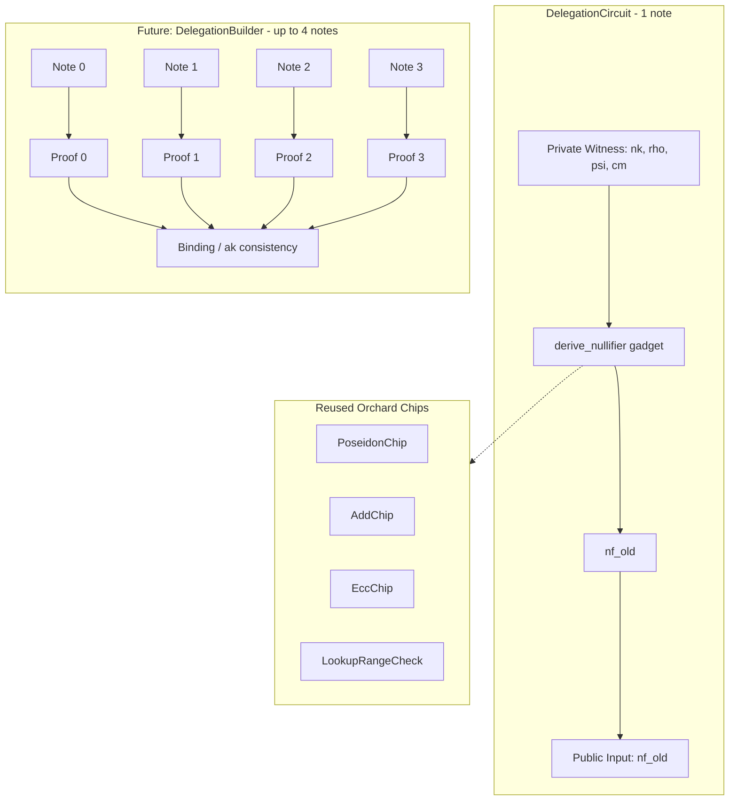

# Delegation Circuit — Nullifier Integrity Milestone

## Context

The existing **vote circuit** (`[src/vote/circuit.rs](src/vote/circuit.rs)`) proves nullifier integrity for a single note by calling `derive_nullifier` from `[src/circuit/gadget.rs](src/circuit/gadget.rs)`. That gadget computes:

```
nf_old = extract_p( K * mod_r_p( Poseidon(nk, rho) + psi ) + cm )
```

The delegation circuit follows the **same 1-circuit-per-note pattern**. For multiple notes (up to 4), the builder layer (future milestone) will create multiple independent proofs and bind them — exactly as the vote ballot does via `Vec<VoteProof>` and a binding signature.

Per the README, `nf_old` is **not** exposed publicly in the final circuit (a domain nullifier `gov_null` will take its place). For this milestone, we temporarily expose `nf_old` as a public input for testability.

## Architecture




## Key Design Decisions

- **1 circuit = 1 note**: Follows the vote circuit pattern. Each `DelegationCircuit` processes exactly one note. Multiple notes produce multiple proofs, bound externally.
- **Public input (temporary)**: Expose `nf_old` as the single public input for this milestone. In later milestones, `nf_old` becomes internal and `gov_null` (domain nullifier) replaces it as the public output.
- **Minimal chip set**: Only `EccChip`, `PoseidonChip`, `AddChip`, and `LookupRangeCheckConfig`. No Sinsemilla, Merkle, NoteCommit, or IntervalChip — those come in future milestones.
- **Circuit size**: Start with `K = 12` (4096 rows). A single nullifier derivation costs ~1 Poseidon hash + 1 fixed-base scalar mul + 1 point addition — well within K=12.
- **rho constraint**: Standard Orchard — `rho` is constrained implicitly through the note commitment integrity (future milestone) and the nullifier derivation (this milestone).
- **Reuse vote proof infrastructure**: The `[src/vote/proof.rs](src/vote/proof.rs)` `Proof<S>`, `ProvingKey<S>`, `VerifyingKey<S>` types are generic over `Statement`. The delegation circuit implements `Statement` so it can reuse the same proof machinery.

## Files to Create

### `[src/delegation/mod.rs](src/delegation/mod.rs)`

Module root. Declares `pub mod circuit` and re-exports key types.

```rust
pub mod circuit;

pub use circuit::{Circuit, Instance};
```

### `[src/delegation/circuit.rs](src/delegation/circuit.rs)`

The delegation halo2 circuit. Mirrors the vote circuit structure but stripped down to only nullifier derivation.

**Circuit struct** — single-note witness fields, matching the vote circuit's pattern:

```rust
#[derive(Clone, Debug, Default)]
pub struct Circuit {
    nk: Value<pallas::Base>,
    rho_old: Value<pallas::Base>,
    psi_old: Value<pallas::Base>,
    cm_old: Value<NoteCommitment>,  // Pallas affine point
}
```

**Config** — minimal chip set:

```rust
#[derive(Clone, Debug)]
pub struct Config {
    primary: Column<InstanceColumn>,
    advices: [Column<Advice>; 10],
    add_config: AddConfig,
    ecc_config: EccConfig<OrchardFixedBases>,
    poseidon_config: PoseidonConfig<pallas::Base, 3, 2>,
}
```

`**configure()**` — follows the vote circuit's chip setup (lines 252-460 of `src/vote/circuit.rs`) but omits Sinsemilla, Merkle, NoteCommit, CommitIvk, and IntervalChip:

1. Create 10 advice columns (required by EccChip)
2. Create lookup table column + `LookupRangeCheckConfig`
3. Create fixed columns for Lagrange coefficients (required by EccChip)
4. `EccChip::configure(meta, advices, lagrange_coeffs, range_check)`
5. `PoseidonChip::configure(...)` with 2 of the advice columns
6. `AddChip::configure(...)` with 3 of the advice columns
7. Create instance column for public inputs

`**synthesize()**` — the core logic:

1. Load the lookup range check table (needed by ECC operations). Since we skip Sinsemilla, investigate whether `LookupRangeCheckConfig` has a standalone table loader or if we need a minimal Sinsemilla load.
2. Witness `nk` as a free advice cell
3. Witness `rho_old` as a free advice cell
4. Witness `psi_old` as a free advice cell
5. Witness `cm_old` as a `Point` via `EccChip`
6. Call `crate::circuit::gadget::derive_nullifier(poseidon_chip, add_chip, ecc_chip, rho_old, &psi_old, &cm_old, nk)` — reuse the existing gadget directly
7. Constrain the result to the public input: `layouter.constrain_instance(nf_old.inner().cell(), config.primary, NF_OLD)`

`**Instance` struct** — single public input:

```rust
pub struct Instance {
    pub nf_old: Nullifier,
}

impl Halo2Instance for Instance {
    fn to_halo2_instance(&self) -> Vec<vesta::Scalar> {
        vec![self.nf_old.0]
    }
}
```

`**Statement` trait impl** — enables reuse of `Proof<Circuit>`, `ProvingKey<Circuit>`, `VerifyingKey<Circuit>` from `src/vote/proof.rs`:

```rust
impl super::proof::Statement for Circuit {
    type Circuit = Circuit;
    type Instance = Instance;
}
```

Note: the proof module at `[src/vote/proof.rs](src/vote/proof.rs)` may need to be moved to a shared location or re-exported so the delegation module can use it. Alternatively, duplicate it in `src/delegation/proof.rs` for now and unify later.

`**from_action_context` constructor** — builds the circuit from Orchard note primitives:

```rust
impl Circuit {
    pub fn from_note_unchecked(
        fvk: &FullViewingKey,
        note: Note,
    ) -> Self {
        let rho_old = note.rho();
        let psi_old = note.rseed().psi(&rho_old);
        Circuit {
            nk: Value::known(fvk.nk().inner()),
            rho_old: Value::known(rho_old.0),
            psi_old: Value::known(psi_old),
            cm_old: Value::known(note.commitment()),
        }
    }
}
```

## Files to Modify

### `[src/lib.rs](src/lib.rs)`

Add the delegation module behind a feature flag (following the vote module pattern at line 32-33):

```rust
#[cfg(feature = "delegation")]
pub mod delegation;
```

### `[Cargo.toml](Cargo.toml)`

Add the `delegation` feature flag:

```toml
[features]
delegation = []
```

## Testing Strategy

Tests go in `src/delegation/circuit.rs` as `#[cfg(test)] mod tests`.

- **Happy path**: Create a real Orchard note via `Note::dummy()`, derive its nullifier natively using `Nullifier::derive(nk, rho, psi, cm)`, populate the `Circuit`, run `MockProver::run` with the expected nullifier as the public input. Assert `verify()` succeeds.
- **Wrong key**: Use a different `nk` than the note's actual nullifier deriving key. Assert `MockProver::verify()` fails (constraint unsatisfied).
- **Dummy note**: Create a note with `Note::dummy()` and value=0. Verify the circuit works identically — the derivation doesn't depend on value.

Use `halo2_proofs::dev::MockProver` — no need for a full proving key setup in this milestone.

## Integration Points for Future Milestones

The derived `nf_old` (returned from `derive_nullifier` as `X<pallas::Affine, EccChip>`) will be consumed by these additions to the circuit:

- **Domain nullifier / gov_null**: `derive_domain_nullifier(domain, rho, psi, cm, nk)` — replaces `nf_old` as the public output
- **Interval checking**: `IntervalChip::check_in_interval(nf_old, nf_start, nf_end)` — same pattern as the vote circuit
- **Merkle path**: Anchor verification via `MerkleChip` using `cm_old`
- **Note commitment integrity**: `note_commit(g_d, pk_d, v, rho, psi, rcm)` constrained to equal witnessed `cm_old`
- **ak ownership / rk**: `[alpha] SpendAuthG + ak_P` constrained as public input

The builder layer (separate milestone) will:

- Create up to 4 `Circuit` instances (one per note, dummy padding for unused slots)
- Generate a proof per circuit using `Proof::<Circuit>::create`
- Bundle proofs into a `DelegationBallot` struct
- Enforce `ak` consistency across all proofs (e.g., shared `rk` public input or binding signature)
- Compute `van_comm` from the sum of all note values

